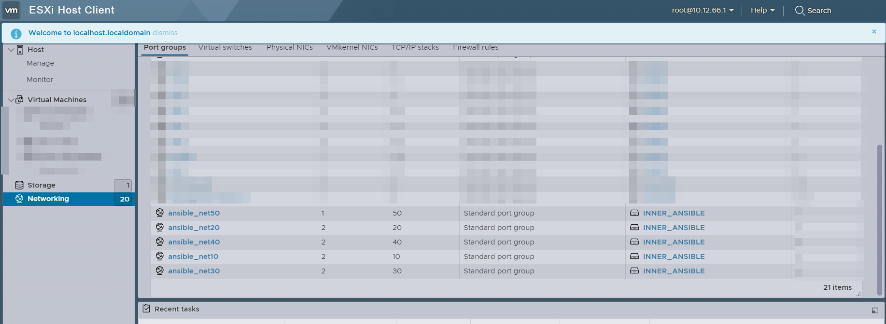

# Автоматизация сборки стенда

Конечный результат будет выглядить вот так:

```
---

- name: Настройка виртуальных подключений на ESXi
  hosts: esxi
  tasks:
    - name: Добавляем виртуальный коммутатор
      community.vmware.vmware_vswitch:
        validate_certs: false
        hostname: '{{ esxi_hostname }}'
        username: '{{ esxi_username }}'
        password: '{{ esxi_password }}'
        switch: '{{ item.name }}'
        mtu: 9000
        security:
          promiscuous_mode: true
          mac_changes: true
          forged_transmits: true
      delegate_to: localhost
      loop: "{{ vars.vars.vswitchs }}"

    - name: Добавление порт-групп на виртуальный коммутатор
      community.vmware.vmware_portgroup:
        validate_certs: false
        hostname: '{{ esxi_hostname }}'
        username: '{{ esxi_username }}'
        password: '{{ esxi_password }}'
        switch: '{{ item[0].name }}'
        hosts: ['{{ esxi_hostname }}']
        portgroup: '{{ item[1].name }}'
        vlan_id: '{{ item[1].vlan }}'
      delegate_to: localhost
      with_subelements:
        - "{{ vars.vars.vswitchs }}"
        - port_groups
```


playbook будет запущен для конкретного хоста `esxi`

```
- name: Настройка виртуальных подключений на ESXi
  hosts: esxi
  tasks:
```


Весть `playbook` состот из двух задач. Разберем их подробнее 

## Задача №1 - Добавляем виртуальный коммутатор

```
    - name: Добавляем виртуальный коммутатор
      community.vmware.vmware_vswitch:
        validate_certs: false
        hostname: '{{ esxi_hostname }}'
        username: '{{ esxi_username }}'
        password: '{{ esxi_password }}'
        switch: '{{ item.name }}'
        mtu: 9000
        security:
          promiscuous_mode: true
          mac_changes: true
          forged_transmits: true
      delegate_to: localhost
      loop: "{{ vars.vars.vswitchs }}"
```

`community.vmware.vmware_vswitch:` - набор для управления виртуальными коммутаторами от VMware - Подробнее [здесь](https://docs.ansible.com/ansible/latest/collections/community/vmware/vmware_vswitch_module.html)

`validate_certs: false` - Отключаем проверку сертификата при Подключение

Это переменные для подключения к ESXi. Беруться они из инвентарного файла

```
hostname: '{{ esxi_hostname }}'
username: '{{ esxi_username }}'
password: '{{ esxi_password }}'
```
 
`loop: "{{ vars.vars.vswitchs }}"` - запускает цикл для переменной `vswitchs`. Эта переменная находится в инвентарном файле и привязана к хосту под названием `esxi`.

Каждый элемент массива `vswitchs` записывается в переменную `item` к которой мы можем обратиться внутри задачи

`switch: '{{ item.name }}'` - Задаем имя свича


Это просто настройки виртуального свича
```
mtu: 9000
security:
    promiscuous_mode: true
    mac_changes: true
    forged_transmits: true
```

`delegate_to: localhost` - Обязательный параметр. Нужен чтобы эта задача выполнялась на хосте с Ansible. Иначе Ansible попытается подключиться к esxi и выпольнить ее на нем.

## Задача №2 - Добавление порт-групп на виртуальный коммутатор

```
    - name: Добавление порт-групп на виртуальный коммутатор
      community.vmware.vmware_portgroup:
        validate_certs: false
        hostname: '{{ esxi_hostname }}'
        username: '{{ esxi_username }}'
        password: '{{ esxi_password }}'
        switch: '{{ item[0].name }}'
        hosts: ['{{ esxi_hostname }}']
        portgroup: '{{ item[1].name }}'
        vlan_id: '{{ item[1].vlan }}'
      delegate_to: localhost
      with_subelements:
        - "{{ vars.vars.vswitchs }}"
        - port_groups
```

Подробнее про коллекцию `community.vmware.vmware_portgroup` [здесь](https://docs.ansible.com/ansible/latest/collections/community/vmware/vmware_portgroup_module.html)

Эта задача немного сложнее предыдущей.

Обратите внимание на инструкцию `with_subelements:`

При помощи нее мы делаем вложенный цикл.

Напомню, что в переменной `vswitchs` может лежать не один коммутатор а несколько. Поэтому нам нужно перебрать их, а внутри каждого лежит список `port_groups`, который также нужно перебрать.

Получается мы запускаем цикла для `"{{ vars.vars.vswitchs }}"`, а внутри него запускаем цикл для `port_groups`, которая находится в текущем элементе первого цыкла.

Чтобы внутри задачи обратиться к текущему элементу первого цыкла используем переменную `{{ item[0] }}`, а чтобы обратиться к текущему элементу вложенного цыкла используем переменную `{{ item[1] }}`

## Результат выполнения playbook

<p align="center">
  
</p>