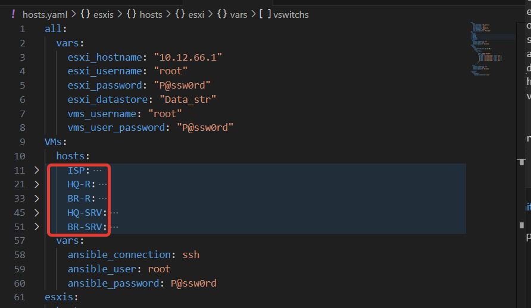
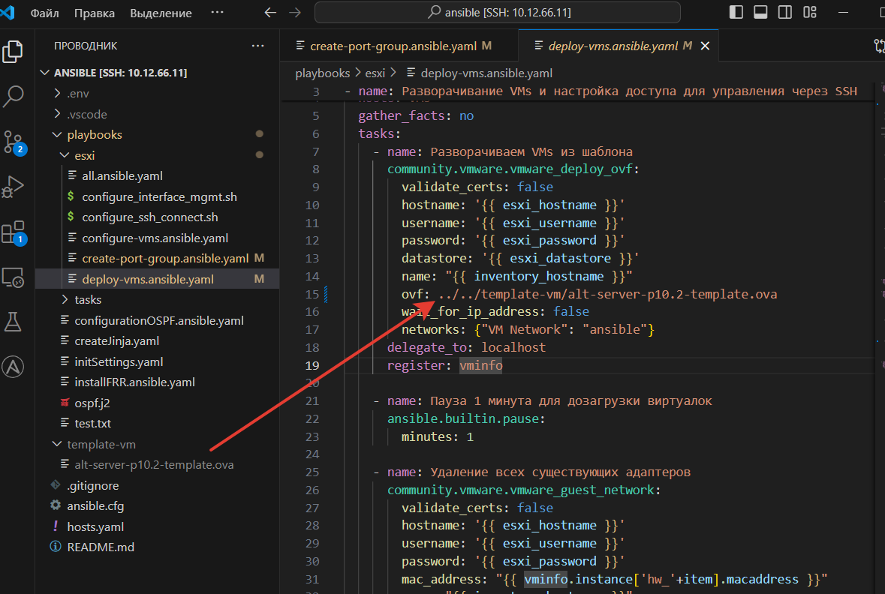

# Автоматическое развертывание виртуальных машин из шаблона


В этом `playbook` нам понадобиться выполнение `bash` скрипта, который лежит тут [рядышком](./configure_interface_mgmt.sh). В нем есть комментарии. Почитайте их.

Конечный `playbook` выглядит вот так:

```
---

- name: Разворачивание VMs и настройка доступа для управления через SSH
  hosts: VMs
  gather_facts: no
  tasks:
    - name: Разворачиваем VMs из шаблона
      community.vmware.vmware_deploy_ovf:
        validate_certs: false
        hostname: '{{ esxi_hostname }}'
        username: '{{ esxi_username }}'
        password: '{{ esxi_password }}'
        datastore: '{{ esxi_datastore }}'
        name: "{{ inventory_hostname }}"
        ovf: ../../template-vm/alt-server-p10.2-template.ova
        wait_for_ip_address: false
        networks: {"VM Network": "ansible"}
      delegate_to: localhost
      register: vminfo

    - name: Пауза 1 минута для дозагрузки виртуалок
      ansible.builtin.pause:
        minutes: 1

    - name: Удаление всех существующих адаптеров
      community.vmware.vmware_guest_network:
        validate_certs: false
        hostname: '{{ esxi_hostname }}'
        username: '{{ esxi_username }}'
        password: '{{ esxi_password }}'
        mac_address: "{{ vminfo.instance['hw_'+item].macaddress }}"
        name: "{{ inventory_hostname }}"
        state: absent
      delegate_to: localhost
      loop: '{{vminfo.instance.hw_interfaces}}'

    - name: Добавление интерфейса управления на VMs
      community.vmware.vmware_guest_network:
        validate_certs: false
        hostname: '{{ esxi_hostname }}'
        username: '{{ esxi_username }}'
        password: '{{ esxi_password }}'
        name: "{{ inventory_hostname }}"
        state: present
        network_name: "ansible"
      delegate_to: localhost
      register: interface_ansible_info

    - name: Копирование скрипта настройки интерфейса на виртуалки
      community.vmware.vmware_guest_file_operation:
        validate_certs: false
        hostname: '{{ esxi_hostname }}'
        username: '{{ esxi_username }}'
        password: '{{ esxi_password }}'

        vm_id: "{{ inventory_hostname }}"
        vm_username: "{{ vms_username }}"
        vm_password: "{{ vms_user_password }}"
        copy:
            src: "configure_interface_mgmt.sh"
            dest: "/home/student/configure_interface_mgmt.sh"
            overwrite: true
      delegate_to: localhost

    - name: Делаем скрип настройки интерфейса исполняемым файлом
      community.vmware.vmware_vm_shell:
        validate_certs: false
        hostname: '{{ esxi_hostname }}'
        username: '{{ esxi_username }}'
        password: '{{ esxi_password }}'

        vm_id: "{{ inventory_hostname }}"
        vm_username: "{{ vms_username }}"
        vm_password: "{{ vms_user_password }}"
        vm_shell: "/bin/chmod"
        vm_shell_args: "+x /home/student/configure_interface_mgmt.sh"
        wait_for_process: true
      delegate_to: localhost

    - name: Запуск скрипта настройки интерфейса для управления
      community.vmware.vmware_vm_shell:
        validate_certs: false
        hostname: '{{ esxi_hostname }}'
        username: '{{ esxi_username }}'
        password: '{{ esxi_password }}'

        vm_id: "{{ inventory_hostname }}"
        vm_username: "{{ vms_username }}"
        vm_password: "{{ vms_user_password }}"
        vm_shell: "/home/student/configure_interface_mgmt.sh"
        vm_shell_env: 
          - "INTERFACE_MAC={{ interface_ansible_info.network_info[0].mac_address }}"
          - "IP_ADDRESS={{ ansible_ssh_host }}"
          - "IP_MASK=/24"
        wait_for_process: true
      delegate_to: localhost

    - name: Добавление интерфейсов на VMs
      community.vmware.vmware_guest_network:
        validate_certs: false
        hostname: '{{ esxi_hostname }}'
        username: '{{ esxi_username }}'
        password: '{{ esxi_password }}'
        name: "{{ inventory_hostname }}"
        state: present
        network_name: "{{ item.network_name }}"
      loop: "{{ vars.vars.interfaces }}"
      delegate_to: localhost
      register: vm_network_info

    - name: Настраиваем IP на физические интерфейсы
      when: item.network_name != 'ansible'
      community.vmware.vmware_vm_shell:
        validate_certs: false
        hostname: '{{ esxi_hostname }}'
        username: '{{ esxi_username }}'
        password: '{{ esxi_password }}'

        vm_id: "{{ inventory_hostname }}"
        vm_username: "{{ vms_username }}"
        vm_password: "{{ vms_user_password }}"
        vm_shell: "/home/student/configure_interface_mgmt.sh"
        vm_shell_env: 
          - "INTERFACE_MAC={{ item.mac_address }}"
          - "IP_ADDRESS={{ vars.vars | community.general.json_query('interfaces[?network_name==`'+item.network_name+'`].ifaddr') | first }}"
          - "IP_MASK={{vars.vars | community.general.json_query('interfaces[?network_name==`'+item.network_name+'`].mask') | first}}"
        wait_for_process: true
      delegate_to: localhost
      loop: "{{ vm_network_info.results[-1].network_info }}"


- name: Удаляем старые SSH ключи
  hosts: localhost
  tasks:
    - name: Удаляем известные SSH ключи
      ansible.builtin.file:
        path: /home/student/.ssh/known_hosts
        state: absent

- name: Настраиваем SSH подключение к виртуальным машинам
  hosts: VMs
  gather_facts: no
  tasks:
    - name: Копирование скрипта
      community.vmware.vmware_guest_file_operation:
        validate_certs: false
        hostname: '{{ esxi_hostname }}'
        username: '{{ esxi_username }}'
        password: '{{ esxi_password }}'
        vm_id: "{{ inventory_hostname }}"
        vm_username: "{{ vms_username }}"
        vm_password: "{{ vms_user_password }}"
        copy:
            src: "configure_ssh_connect.sh"
            dest: "/home/student/configure_ssh_connect.sh"
            overwrite: true
      delegate_to: localhost

    - name: Делаем скрип исполняемым файлом
      community.vmware.vmware_vm_shell:
        validate_certs: false
        hostname: '{{ esxi_hostname }}'
        username: '{{ esxi_username }}'
        password: '{{ esxi_password }}'
        vm_id: "{{ inventory_hostname }}"
        vm_username: "{{ vms_username }}"
        vm_password: "{{ vms_user_password }}"
        vm_shell: "/bin/chmod"
        vm_shell_args: "+x /home/student/configure_ssh_connect.sh"
        wait_for_process: true
      delegate_to: localhost

    - name: Запуск скрипта настройки ssh на удаленном хосте
      community.vmware.vmware_vm_shell:
        validate_certs: false
        hostname: '{{ esxi_hostname }}'
        username: '{{ esxi_username }}'
        password: '{{ esxi_password }}'
        vm_id: "{{ inventory_hostname }}"
        vm_username: "{{ vms_username }}"
        vm_password: "{{ vms_user_password }}"
        vm_shell: "/home/student/configure_ssh_connect.sh"
        wait_for_process: true
      delegate_to: localhost


- name: Проверка подключения к виртуалкам
  hosts: VMs
  gather_facts: yes
  tasks:
    - name: Проверка
      debug:
        msg: "{{ansible_ssh_host}}"
```

Теперь подробнее...


## Сценарий №1 - Разворачивание VMs и настройка доступа для управления через SSH

Мы будем подключаться к `ESXi` и на нем выполнять сценарии для виртуалок, поэтому в `hosts` указываем переменную `VMs` из инвентарного файла. Чтобы `Ansible` не пытался подключиться к не существующим машинам и собрать о них информацию отключаем сбор фактов `gather_facts: no`


```
hosts: VMs
gather_facts: no
```

### Задача №1 - Разворачиваем VMs из шаблона

```
    - name: Разворачиваем VMs из шаблона
      community.vmware.vmware_deploy_ovf:
        validate_certs: false
        hostname: '{{ esxi_hostname }}'
        username: '{{ esxi_username }}'
        password: '{{ esxi_password }}'
        datastore: '{{ esxi_datastore }}'
        name: "{{ inventory_hostname }}"
        ovf: ../../template-vm/alt-server-p10.2-template.ova
        wait_for_ip_address: false
        networks: {"VM Network": "ansible"}
      delegate_to: localhost
      register: vminfo
```

Подробнее про коллекцию [community.vmware.vmware_deploy_ovf](https://docs.ansible.com/ansible/latest/collections/community/vmware/vmware_deploy_ovf_module.html)

`"{{ inventory_hostname }}"` - переменная Ansible, которая берется из название хоста в инвентарном файле

<p align="center">
  
</p>

`ovf: ../../template-vm/alt-server-p10.2-template.ova` - путь до файла с шаблоном виртуалки

<p align="center">
  
</p>
