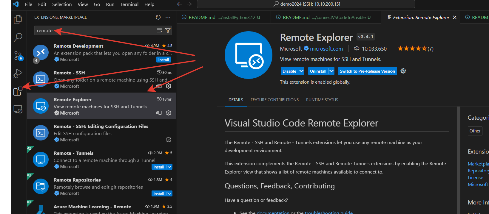
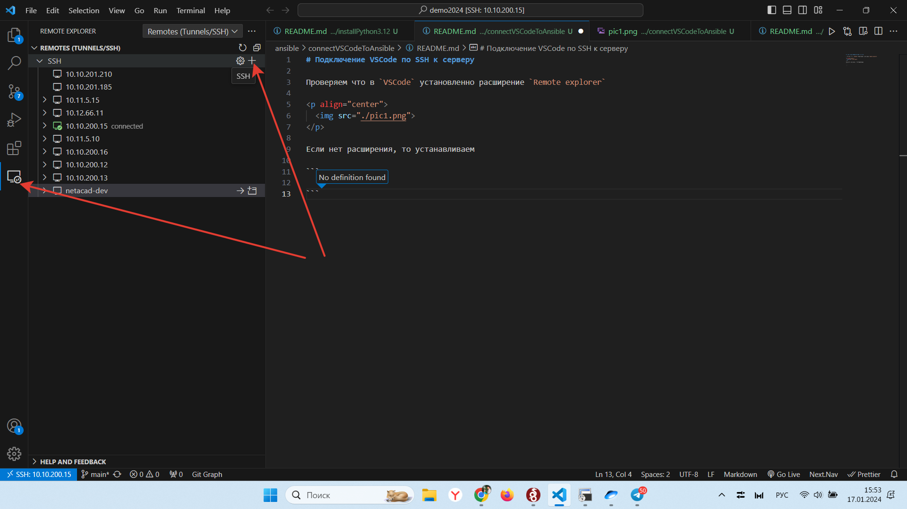
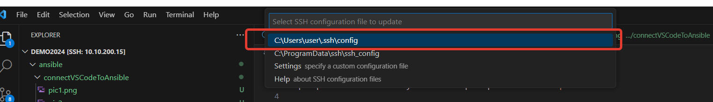
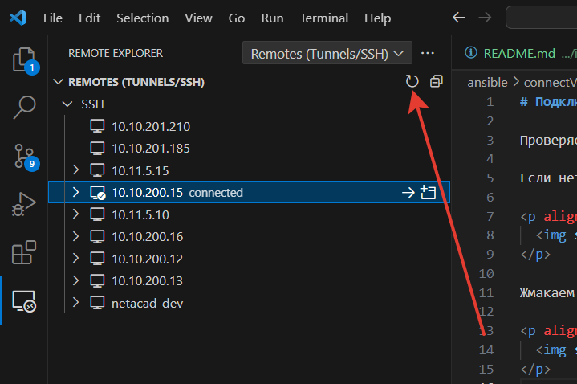
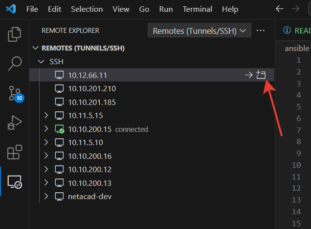
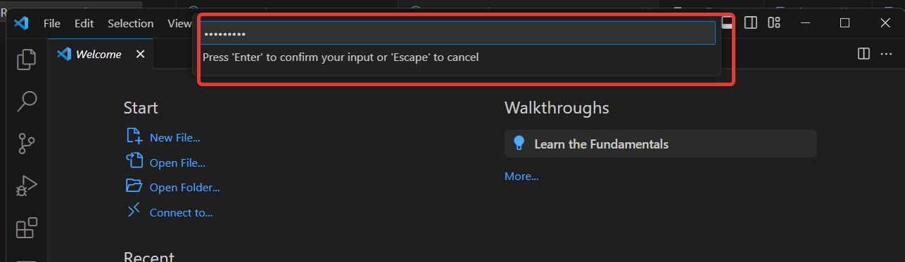
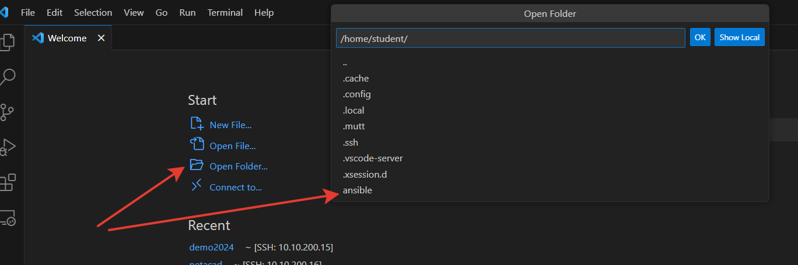

# Подключение VSCode по SSH к серверу

Проверяем что в `VSCode` установленно расширение `Remote explorer` 

Если нет расширения, то устанавливаем

  

Жмакаем на плюсик и добавляем свою виртуалку в список SSH подключений

  

  

Обнавляем список подключений

  

Добавляем папку которая находится на удаленном устройстве

  

  

Ждем, когда на виртуалку установится VSCode

Открываем папку `ansible`, если папки не существует, то создаем ее

  

