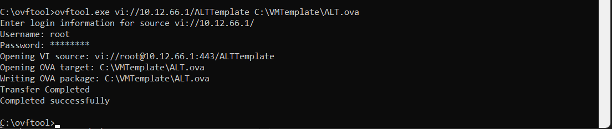
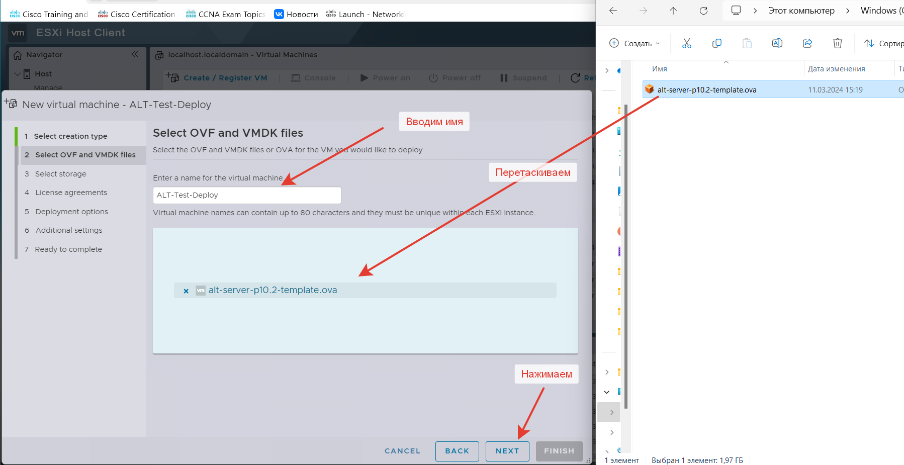

# Подготовка шаблона виртуальной машины для сборки стенда

Нам нужно создать образ OVA с минимальным набором пакетов. Этот шаблон будет использоваться для всех виртуальных машин.

Открываем ваш `ESXi` и в нем проводим стандартную установку виртуальной машины с минимальным набором пакетов.

Рекомендую в параметрах виртуальной машины сделать 4 ядра для CPU и 4Гб оперативной памяти.

Желательно обновить операционку до последней версии. В `ALT Linux` это делается вот так.

```
apt-get update && apt-get dist-upgrade && update-kernel
```

Обязательно установить `open-vm-tools-desktop` и `sshpass`

```
apt-get install open-vm-tools-desktop
apt-get install sshpass
```

При желание вы можете предварительно поставить все пакеты, которые вы будите использовать в этом задание.

Если не установите. Ничего страшного. Установим их в дальнейшем.

## Экспорт виртуальной машыны в OVA формат

На понадобится следующая утилита:
[Open Virtualization Format Tool (ovftool)
](./ovftool.zip)

Скачиваем архив и распаковываем.

Открываем `cmd` с правами администратора и переходим в папку `ovftool`, которую извлекли из архива. У меня она лежит на диске `C:\`

Теперь вводим комманду такого формата

`ovftool.exe <source locator> <target locator>`

У меня эта команда будет выгдалять вот так:

```
ovftool.exe vi://10.12.66.1/ALTTemplate C:\VMTemplate\alt-server-p10.2-template.ova
```
где:

`10.12.66.1` - ip моего ESXi

`ALTTemplate` - имя виртуальной машины

`C:\VMTemplate\alt-server-p10.2-template.ova` - путь на моем компьютере куда скачать шаблон

<p align="center">
  
</p>

Теперь давйте протестируем наш шаблон. Если ли какие-то ошибки при его разворачивание на `ESXi`.

Для этого переходим на ваш `ESXi` и пункт `Create / Register VM`.

В окне выбираем пункт `Deploy a virtual machine from an OVF or OVA file`

<p align="center">
  
</p>

<p align="center">
  
</p>

<p align="center">
  
</p>

<p align="center">
  
</p>

<p align="center">
  
</p>

Дождитесь завершения процесса.

<p align="center">
  
</p>

Запустите созданную виртуальную машину. Убедитесь, что она запускается.

После этого ее можно удалить.

## Копирование шаблона виртуальной машины на машину с Ansible

Откройте `VSCode` и подключитесь через него в виртуальной машине с установленным `Ansible`

Создайте отделную папку `template-vm` 

<p align="center">
  
</p>

Теперь мышкой просто перетащите файл с шаблоном виртуальной машины в папку `template-vm` 

<p align="center">
  
</p>

Дождитесь, когда процесс копирования завершится

<p align="center">
  
</p>

Желательно переименовать шаблон так, чтобы небыло пробелов.
Например вот так:

`alt-server-p10.2-template.ova`