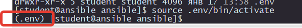

# Создание виртуального окружения Python

В домашнем каталоге пользователя создаем папку `ansible`
У меня пользователь `student`

```
mkdir /home/student/ansible
cd /home/student/ansible
```

Создаем виртуальное окружение

```
python3.12 -m venv .env
```

Пробуем активироваль его

```
source .env/bin/activate
```

Должно получиться так
<p align="center">
  
</p>