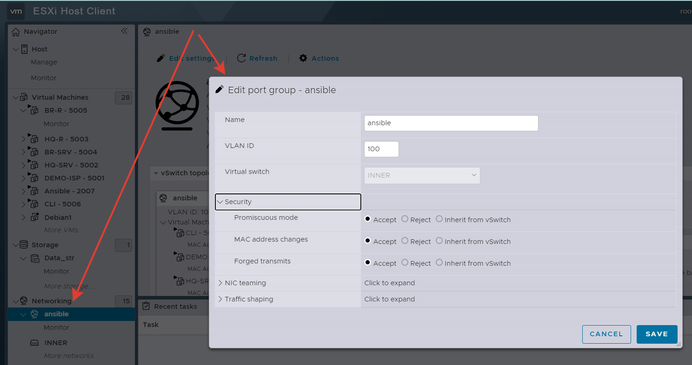
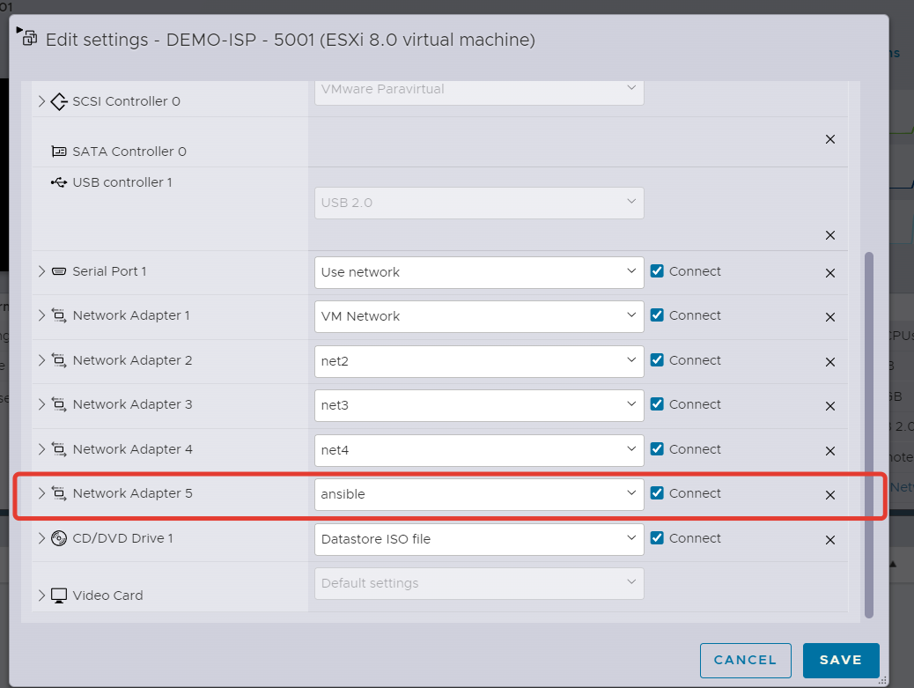

### Подготовка виртуальных машин к управлению через SSH

На всех виртуальных машинах нужно установить `open-vm-tools-desktop` и `sshpass`

```
apt-get install open-vm-tools-desktop
apt-get install sshpass
```

На вашем `ESXi` хосте создайте дополнительну `portgroup` с названием `ansible`

<p align="center">
  
</p>

На виртуальных машинах добавьте еще один интерфейс и подключите его в созданой `portgroup`

<p align="center">
  
</p>

Задайте IP созданным интерфейсам из не существующей подсети. Например из `10.15.15.0/24`

Настройте возможность подключения по `ssh` к виртуальным машинам под пользователем `root`

Для этого нужно отредактировать файл `/etc/openssh/sshd_config`

Заменяем `#PermitRootLogin without_password` на `PermitRootLogin yes`

```
sed -i -e 's/#PermitRootLogin without_password/PermitRootLogin yes/g' /etc/openssh/sshd_config
```

Перезагружаем ssh

```
/etc/init.d/sshd restart
```

Теперь проверяем что с виртуальной машины `ansible` можем подключиться ко всем другим вируальным машинам
`ssh root@IP виртуальной машины`

например:
```
ssh root@10.15.15.2
```