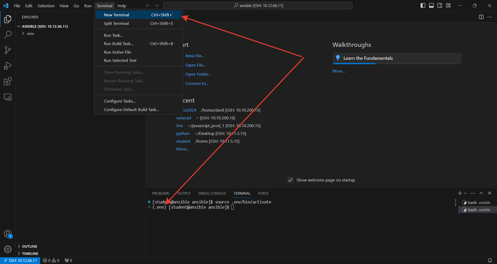

# Установка ansible

В `VSCode` откройте терминал.
Проверьте что вы находитесь в папке `ansible` и у вас активированно виртуальное оркужение

<p align="center">
  
</p>

`Ansible` это пакет `python`. Пакет можно установить при помощи утилиты командной строки `pip`

```
pip install ansible
```