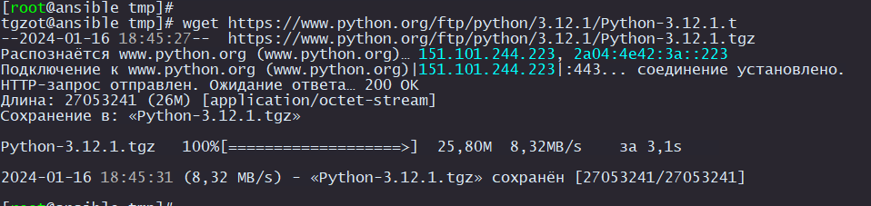
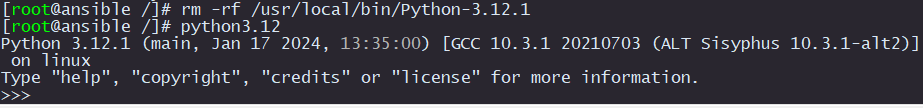

# Установка Python 3.12 на ALT Linux

Для начала установите отдельную виртуальную машину на свой стенд и подключите ее к интернету

Теперь проверим установлена ли утилита для скачивания файлов из интернета

```
wget
```

Если выдало вот такое:

```
-bash: wget: команда не найдена
```

Значит нужно установить wget

```
apt-get install wget
```

После установки wget переходим в папку `/tmp/`
И скачиваем файл с сайта https://www.python.org/

```
cd /tmp/
wget https://www.python.org/ftp/python/3.12.1/Python-3.12.1.tgz
```

<p align="center">
  
</p>

Разархивируем полученный файл

```
tar zxvf Python-3.12.1.tgz
```

Скопируем разархивированную папку

```
cp -r Python-3.12.1 /usr/local/bin
cd /usr/local/bin/Python-3.12.1/
```

Установим пакеты для компиляции

```
apt-get install zlib-devel libssl-devel libsqlite3-devel libffi-devel gcc
apt-get install pip
```

Добавим немного параметров для компиляции

```
./configure --prefix=/usr/local --with-ensurepip=install
```

Начинаем компилировать

```
make
make install
```

Теперь почистим за собой весь мусор

```
make clean
cd /
rm -rf /usr/local/bin/Python-3.12.1
```

Проверяем, что Python3.12 установился

```
python3.12
```

<p align="center">
  
</p>