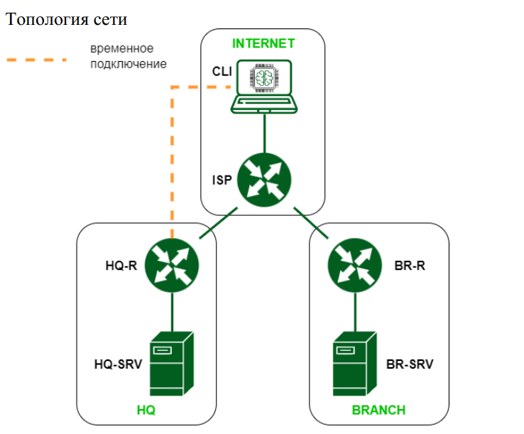

# Модуль 1 - Задание №1

1. Выполните базовую настройку всех устройств:
   * Присвоить имена в соответствии с топологией
   * Рассчитайте IP-адресацию IPv4.Необходимо заполнить таблицу №1, чтобы эксперты могли проверить ваше рабочее место.
   * Пул адресов для сети офиса BRANCH - не более 16
   * Пул адресов для сети офиса HQ - не более 64

| HOSTNAME  | INTERFACE | IP | MASK | DG |
| ------------- | ------------- | ---------- | ---------- | ----------|
| CLI  | 
| ISP  |
| HQ-R |
| HQ-SRV |
| BR-R |
| BR-SRV |
