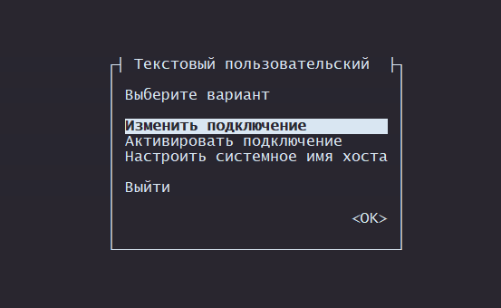
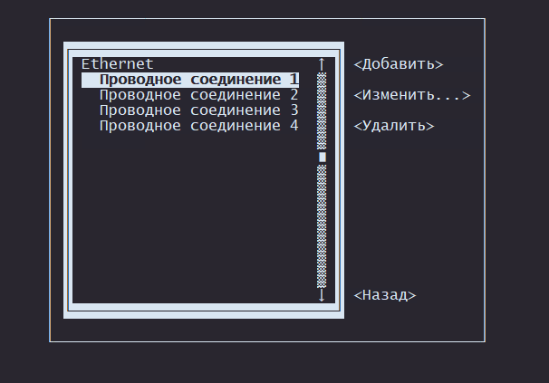
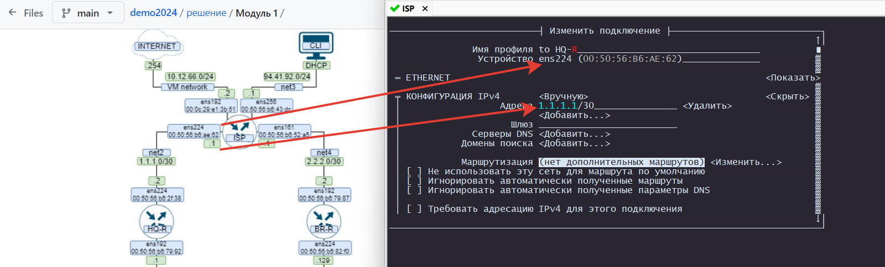
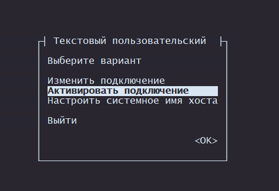
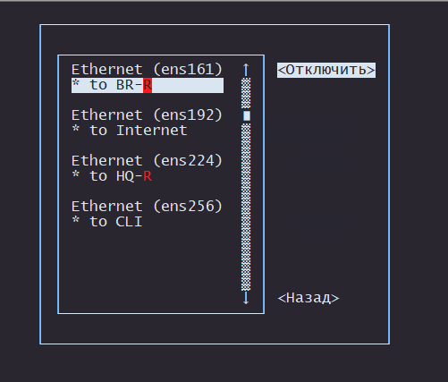
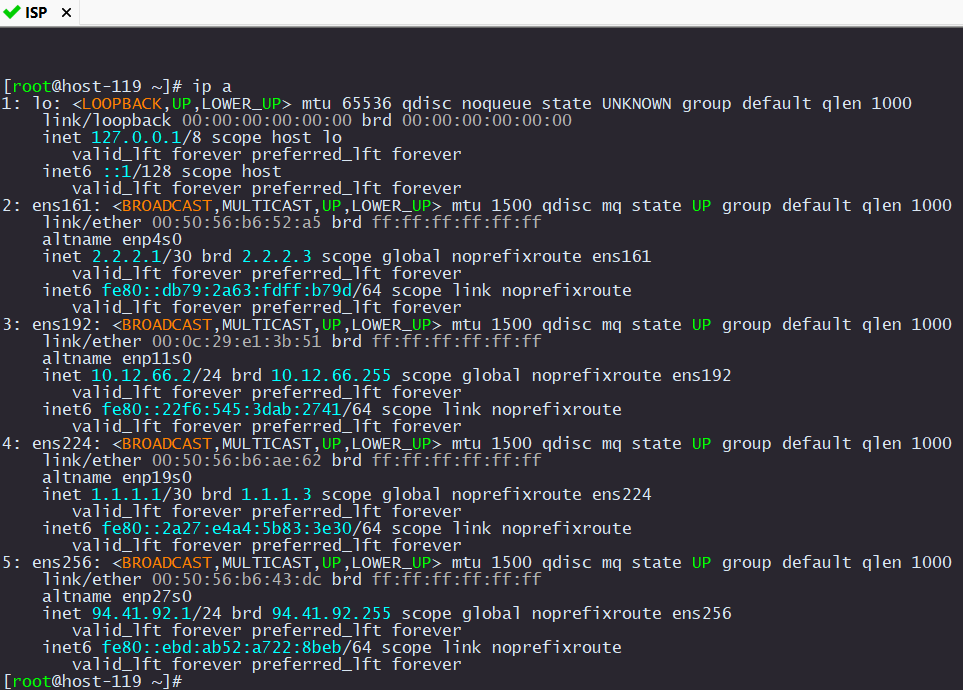

# Настройка IP адресов на интерфейсы

## Настройка ISP

У нас уже установленна удобная утилитка `nmtui`. Запускаем еe
Выбираем пунк `Изменить подключение`

<p align="center">
  
</p>

Переходим в `Проводное подключение 1`

<p align="center">
  
</p>

Для удобства можно изменить имя профиля.

<p align="center">
  
</p>

После настки всех IP адресов нужно перезагрузить интерфейсы. Это можно сделать в `nmtui`

<p align="center">
  
</p>

Выключаем, затем сразу включаем каждый интерфейс

<p align="center">
  
</p>

Должна получиться вот такиая картина в `ip a`

<p align="center">
  
</p>

Также настройте `HOSTNAME` устройств. Это также можно сделать в `nmtui`.

Чтобы изменение `HOSTNAME` вступили в силу нужно перезагрузить устройство

```
systemctl reboot
```

Теперь на кахдом устройстве делаем тоже самое.