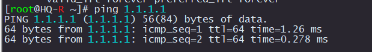

# Настойка сети на HQ-R

Смотрим какие интерфейсы существуют

```
ip a
```

Проверяем существуют ли директории для интерфейсов

```
ls -l /etc/net/ifaces/
```

Если не существуют, то создаем 

```
mkdir /etc/net/ifaces/ens192
mkdir /etc/net/ifaces/ens224
```

Создаем файл `/etc/net/ifaces/ens192/options`

```
echo "TYPE=eth
DISABLED=no
NM_CONTROLLED=no
BOOTPROTO=static
CONFIG_IPv4=yes" > /etc/net/ifaces/ens192/options
```

Копируем `/etc/net/ifaces/ens192/options` в `/etc/net/ifaces/ens224/`

```
cp /etc/net/ifaces/ens192/options /etc/net/ifaces/ens224/
```

Настраиваем IP адреса на интерфейсах

```
echo 192.168.0.1/25 > /etc/net/ifaces/ens192/ipv4address
echo 1.1.1.2/30 > /etc/net/ifaces/ens224/ipv4address
```

Добавим маршрут по умолчанию в сторону ISP:

```
echo default via 1.1.1.1 > /etc/net/ifaces/ens224/ipv4route
```

Включаем маршрутизацию

```
sed -i -e 's/net.ipv4.ip_forward = 0/net.ipv4.ip_forward = 1/g' /etc/net/sysctl.conf
```

Перезагружаем сеть

```
systemctl restart network
```

Проверяем, что IP адреса настроились

```
ip a
```

Если до этого настраивали ISP должен работать ping

```
ping 1.1.1.1
```

<p align="center">
  
</p>