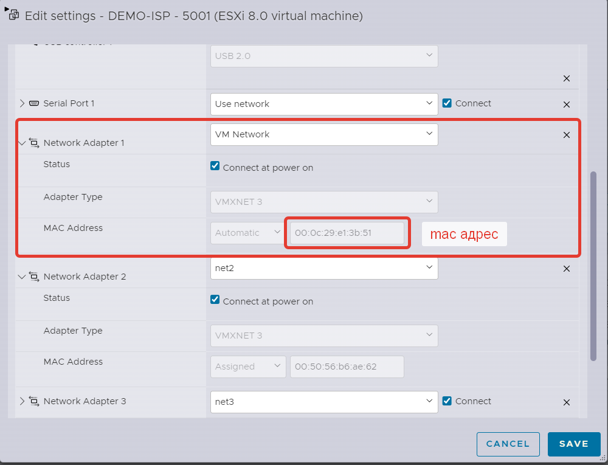
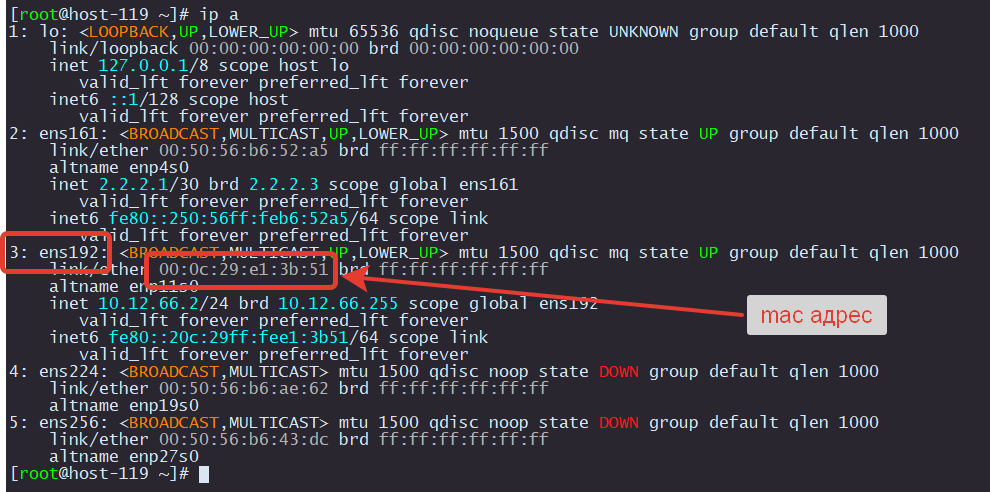
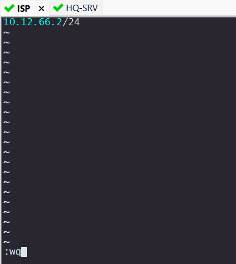
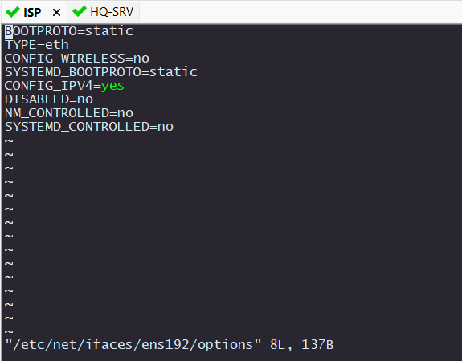

# Подключение виртуальной машины с Интернет.

Чтобы подключить любую виртуальную машину к Интернету достаточно подключить ее сетевой интерфейс к VMnetwork и задать IP из тойже подсети, что и ESXi. Не забывайте, что еще нужно задать IP шлюза и DNS сервера.

<p align="center">
  
</p>

Если на виртуальной машине есть несколько интерфейсов, то не всегда понятно как они соотносятся с интерфейсами в самой ОС.
Идентифицировать их можно по mac-адресу

В данном примере в ОС интерфейс под номером 3, а в списке оборудования виртуальной машины Network Adapter 1

<p align="center">
  
</p>

## Настройка IP адреса

В ALT Linux по умолчанию нет всеми любимого редактора nano, поэтому будем пользоваться vim.
На нужно в файл /etc/net/ifaces/ens192/ipv4address написать IP.

> [!CAUTION]
> Если вы настроете на виртуалке такойже IP как и на ESXi, то вы потеряете доступ к вашему стенду полностью


```
vim /etc/net/ifaces/ens192/ipv4address 
```

Надеюсь вы уже нашли мануал как пользоваться VIM

```
i - режим редактирования
<ESC> - выход из режима редактирования
:q! - выйти без сохранения
:wq - выйти с сохранением
```

<p align="center">
  
</p>

Также отредактируем файл /etc/net/ifaces/ens192/options

```
vim /etc/net/ifaces/ens192/options
```

<p align="center">
  
</p>

Зададим шлюз. Это такой же IP как и шлюз у вашего ESXi

```
vim /etc/net/ifaces/ens192/ipv4route
```