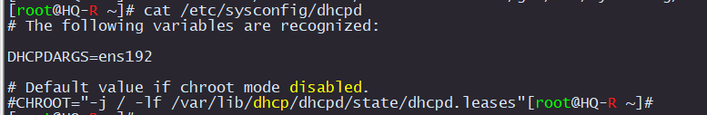
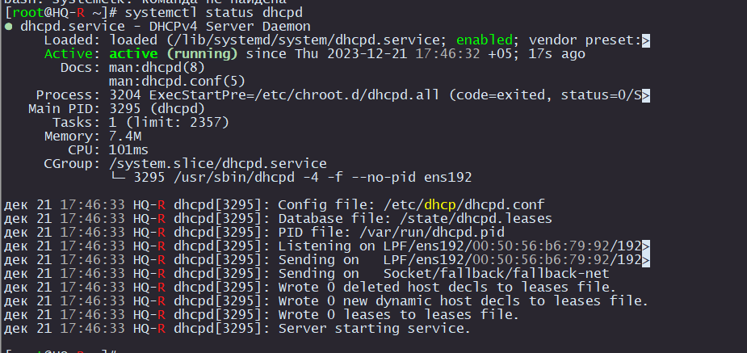
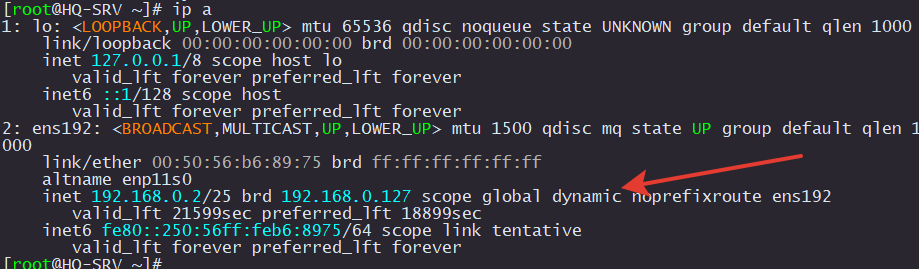

# Настройка автоматической раздачи IP адресов на HQ-R

Подключаем интернет, как это дедали при установке [frr](../createDynamicRouting/installFRRtoInternet/README.md) 

Подробнее про [DHCP-сервер](https://www.altlinux.org/DHCP_%D1%81%D0%B5%D1%80%D0%B2%D0%B5%D1%80)

Устанавливаем `dhcp-server`

```
apt-get install dhcp-server
```

В первую очередь настроим на каком интерфейсе будет работать DHCP-сервер

В моем случае это `ens192`.

Отредактируем файл `/etc/sysconfig/dhcpd`

```
sed -i -e 's/DHCPDARGS=/DHCPDARGS=ens192/g' /etc/sysconfig/dhcpd
```

Проверьте, что все получилось правильно

```
cat /etc/sysconfig/dhcpd
```

<p align="center">
  
</p>

В комплекте с DHCP-сервером есть примеры конфигурации, которые находятся здесь `/etc/dhcp/`

Воспользуемся самым простым примером

```
cp /etc/dhcp/dhcpd.conf.sample /etc/dhcp/dhcpd.conf
```

Теперь редактируем `/etc/dhcp/dhcpd.conf`

```
vim /etc/dhcp/dhcpd.conf
```

Приводим его к такому виду .

```
# See dhcpd.conf(5) for further configuration

ddns-update-style none;

subnet 192.168.0.0 netmask 255.255.255.128 {
        option routers                  192.168.0.1;
        option subnet-mask              255.255.255.128;

#       option nis-domain               "domain.org";
#       option domain-name              "domain.org";
#       option domain-name-servers      192.168.1.1;

        range dynamic-bootp 192.168.0.2 192.168.0.100;
        default-lease-time 21600;
        max-lease-time 43200;

        host HQ-SRV
        {
        hardware ethernet 00:50:56:b6:89:75;
        fixed-address 192.168.0.2;
        }
}
```

ВНИМАНИЕ!.
> [!CAUTION]
> Кусок конфига, который относится к резервированию IP адреса содержит MAC-адрес `HQ-SRV`. У каждого он будет свовой


```
        host HQ-SRV
        {
        hardware ethernet 00:50:56:b6:89:75;
        fixed-address 192.168.0.2;
        }
```

Включаем DHCP-сервер

```
systemctl enable --now dhcpd
```

Проверка

```
systemctl status dhcpd
```

<p align="center">
  
</p>


### Настройка HQ-SRV для получения IP-адреса автоматически

Удаляем текущую статическую конфигурацию.

```
rm -f /etc/net/ifaces/ens192/ipv4address 
rm -f /etc/net/ifaces/ens192/ipv4route
```

Изменяем опцию получения адреса

```
sed -i -e 's/BOOTPROTO=static/BOOTPROTO=dhcp/g' /etc/net/ifaces/ens192/options
```

Перезагружаем сеть

```
systemctl restart network
```

Проверяем

<p align="center">
  
</p>