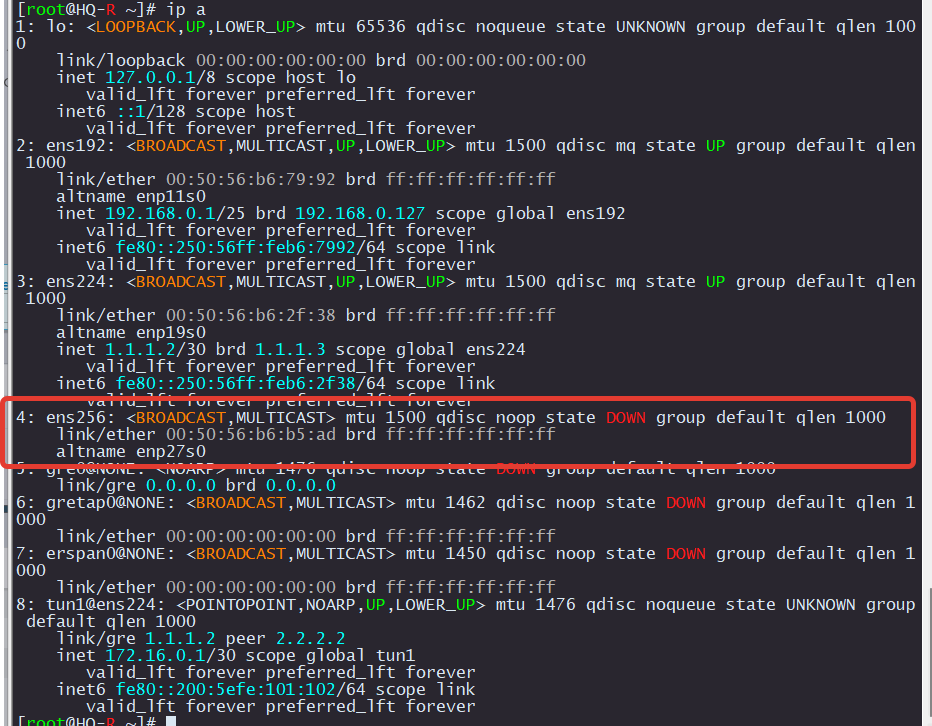
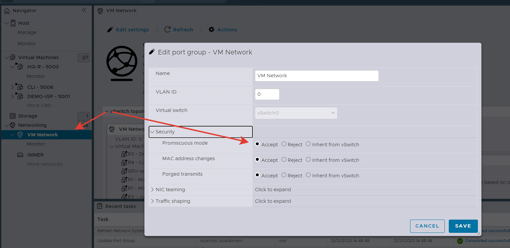
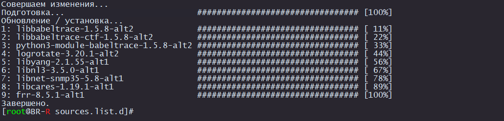
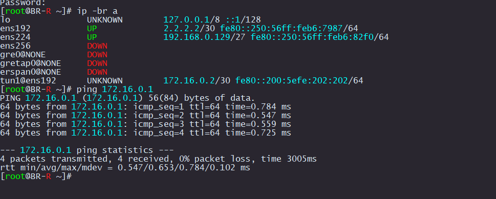

# Настройка динамической маршрутизации

Для настройки маршрутизации нужно установить пакет frr на HQ-R и BR-R.

Но проблема в отсутствие интернета на этих устройствах. Здесь могут быть два подхода. Подключить установочный диск и установить с него, а можно временно подключить интернет.

Попробуем сделать методом подключения интернета.

### HQ-R

Выключаем HQ-R и добавляем еще один интерфейс с сетью VMnetwork

<p align="center">
  
</p>

Назначим ему свободный IP из сети VMnetwork. У меня это сеть 10.12.66.0/24

- 10.12.66.1 занят под сам ESXi
- 10.12.66.2 занят под ISP
- 10.12.66.3 назначим HQ-R
- 10.12.66.4 назначим BR-R

Настраиваем IP, шлюз и DNS на ens256

Удаляем шлюз с ens224. После установки FRR нужно будет все вернуть назад


```
mkdir /etc/net/ifaces/ens256
echo "TYPE=eth
DISABLED=no
NM_CONTROLLED=no
BOOTPROTO=static
CONFIG_IPv4=yes" > /etc/net/ifaces/ens256/options
echo 10.12.66.3/24 > /etc/net/ifaces/ens256/ipv4address
echo default via 10.12.66.254 > /etc/net/ifaces/ens256/ipv4route
echo nameserver 8.8.8.8 > /etc/net/ifaces/ens256/resolv.conf
rm -rf /etc/net/ifaces/ens224/ipv4route
systemctl restart network
```

Проверка

<p align="center">
  
</p>

Может быть, что ESXi будет блокировать трафик. Добавим разрешения.

<p align="center">
  
</p>

На всякий случай обновим список пакетов

```
apt-get update
```

Теперь можем устанавливать `frr` и включить его

```
apt-get install frr
systemctl enable --now frr
```

### BR-R

```
mkdir /etc/net/ifaces/ens256
echo "TYPE=eth
DISABLED=no
NM_CONTROLLED=no
BOOTPROTO=static
CONFIG_IPv4=yes" > /etc/net/ifaces/ens256/options
echo 10.12.66.4/24 > /etc/net/ifaces/ens256/ipv4address
echo default via 10.12.66.254 > /etc/net/ifaces/ens256/ipv4route
echo nameserver 8.8.8.8 > /etc/net/ifaces/ens256/resolv.conf
rm -rf /etc/net/ifaces/ens192/ipv4route
systemctl restart network
apt-get install frr
systemctl enable --now frr
```

<p align="center">
  
</p>

Теперь нужно отключить интернет


### HQ-R

```
rm -rf /etc/net/ifaces/ens256
echo default via 1.1.1.1 > /etc/net/ifaces/ens224/ipv4route
systemctl reboot
```

### BR-R

```
rm -rf /etc/net/ifaces/ens256
echo default via 2.2.2.1 > /etc/net/ifaces/ens192/ipv4route
systemctl reboot
```

Проверка, что все восстановили

<p align="center">
  
</p>