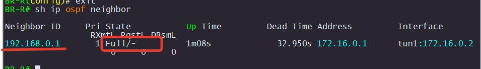

# Настройка FRR

### HQ-R

В файле `/etc/frr/daemons` активируем протокол `OSPF`

```
sed -i -e 's/ospfd=no/ospfd=yes/g' /etc/frr/daemons
systemctl restart frr
```

Настраиваем OSPFv2 - переходим в интерфейс frr при помощи команды `vtysh`:

```
HQ-R# conf t
HQ-R(config)# router ospf
HQ-R(config-router)# passive-interface default 
HQ-R(config-router)# network 192.168.0.0/25 area 0
HQ-R(config-router)# network 172.16.0.0/30 area 0
HQ-R(config-router)# exit
HQ-R(config)# int tun1 
HQ-R(config-if)# ip ospf network point-to-point 
HQ-R(config-if)# no ip ospf passive 
HQ-R(config-if)# do wr
```

### BR-R

В файле `/etc/frr/daemons` активируем протокол `OSPF`

```
sed -i -e 's/ospfd=no/ospfd=yes/g' /etc/frr/daemons
systemctl restart frr
```

Настраиваем OSPFv2 - переходим в интерфейс frr при помощи команды `vtysh`:

```
BR-R# conf t
BR-R(config)# router ospf
BR-R(config-router)# passive-interface default 
BR-R(config-router)# network 192.168.0.128/27 area 0
BR-R(config-router)# network 172.16.0.0/30 area 0
BR-R(config-router)# int tun1
BR-R(config-if)# ip ospf network point-to-point 
BR-R(config-if)# no ip ospf passive 
BR-R(config-if)# do wr
```

Проверка

<p align="center">
  
</p>

<p align="center">
  
</p>

<p align="center">
  
</p>

<p align="center">
  
</p>