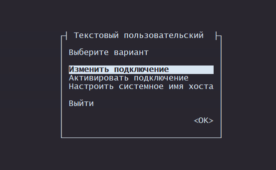
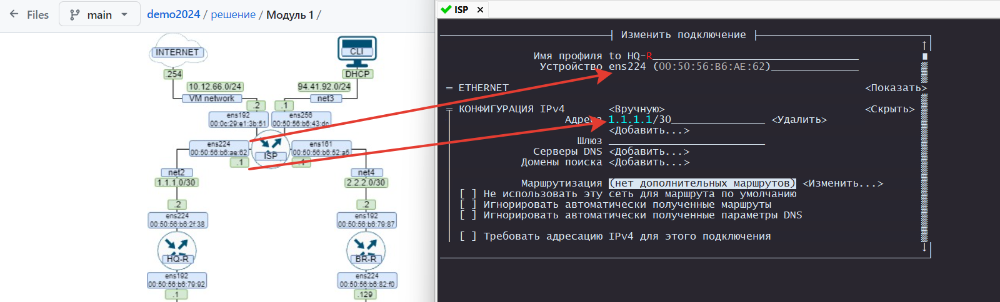
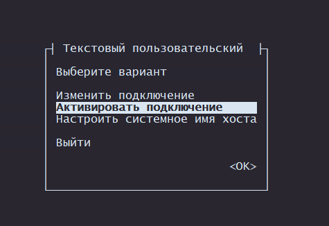
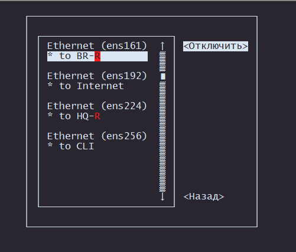
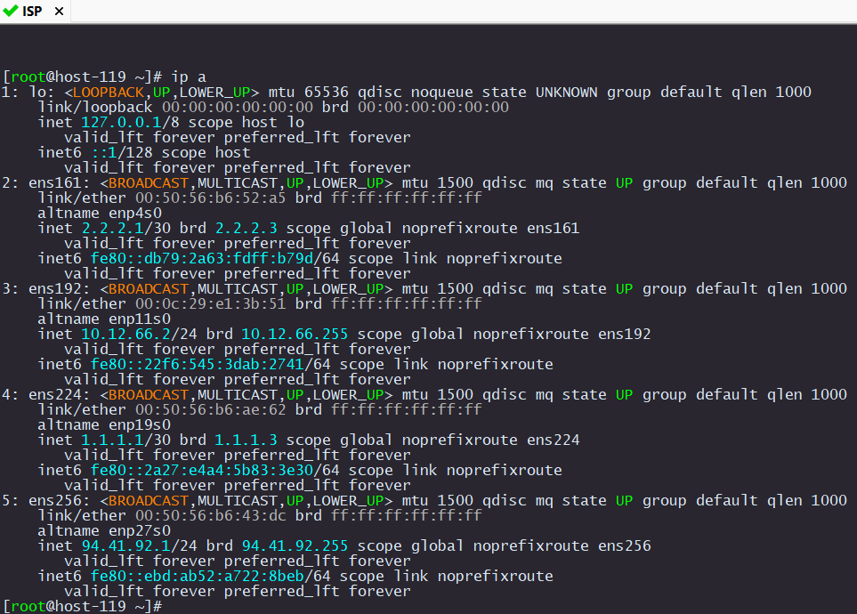

# Настройка IP адресов на интерфейсы

## Настройка ISP

У нас уже установленна удобная утилитка `nmtui`. Запускаем еe. Выбираем пунк `Изменить подключение`

<p align="center">
  
</p>

Переходим в `Проводное подключение 1`

<p align="center">
  
</p>

Для удобства можно изменить имя профиля.

<p align="center">
  
</p>

После настройки всех IP адресов нужно перезагрузить интерфейсы. Это можно сделать в `nmtui`

<p align="center">
  
</p>

Выключаем, затем сразу включаем каждый интерфейс

<p align="center">
  
</p>

Либо коммандой в консоле

```
systemctl restart network.service
```

Должна получиться вот такая картина в `ip a`

<p align="center">
  
</p>

Теперь на каждом устройстве делаем тоже самое.