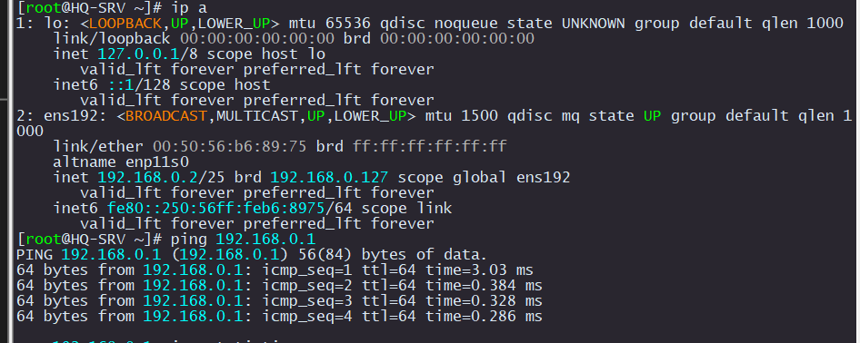

# Настойка сети на HQ-SRV

Смотрим какие интерфейсы существуют

```
ip a
```

Проверяем существуют ли директории для интерфейсов

```
ls -l /etc/net/ifaces/
```

Если не существуют, то создаем 

```
mkdir /etc/net/ifaces/ens192
```

Создаем файл `/etc/net/ifaces/ens192/options`

```
echo "TYPE=eth
DISABLED=no
NM_CONTROLLED=no
BOOTPROTO=static
CONFIG_IPv4=yes" > /etc/net/ifaces/ens192/options
```

Настраиваем IP адреса на интерфейсах

```
echo 192.168.0.2/25 > /etc/net/ifaces/ens192/ipv4address
```

Добавим маршрут по умолчанию в сторону HQ-R:

```
echo default via 192.168.0.1 > /etc/net/ifaces/ens192/ipv4route
```

Включаем маршрутизацию

```
sed -i -e 's/net.ipv4.ip_forward = 0/net.ipv4.ip_forward = 1/g' /etc/net/sysctl.conf
```

Перезагружаем сеть

```
systemctl restart network
```

Проверяем, что IP адреса настроились

```
ip a
```

Если до этого настраивали ISP должен работать ping

```
ping 192.168.0.1
```

<p align="center">
  
</p>