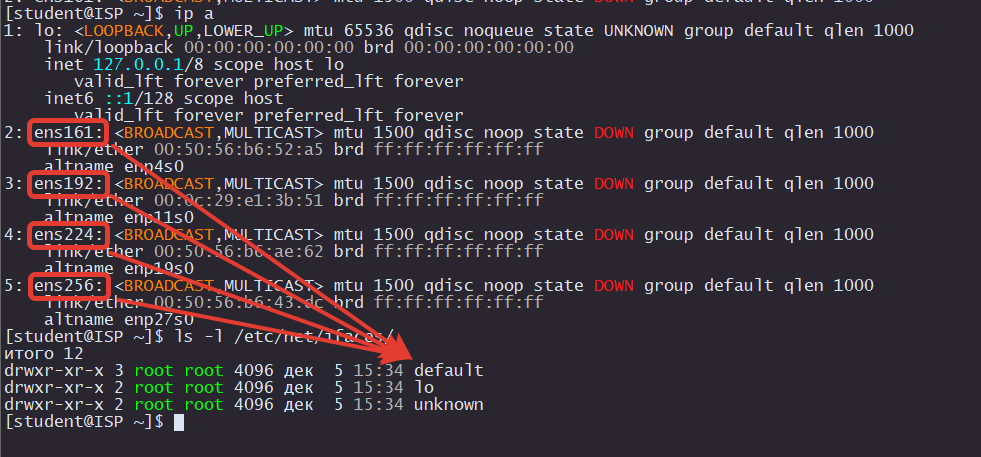
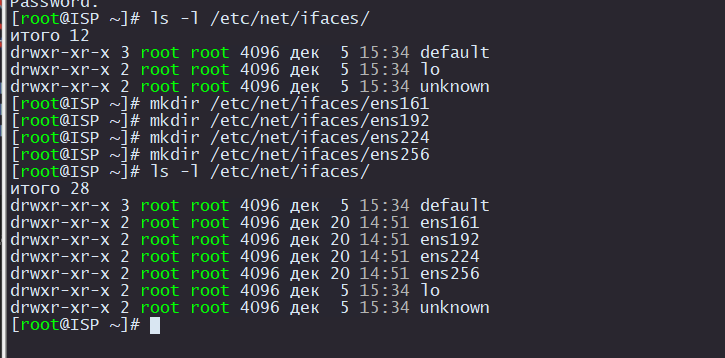
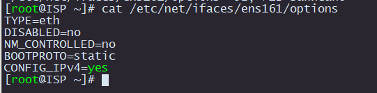
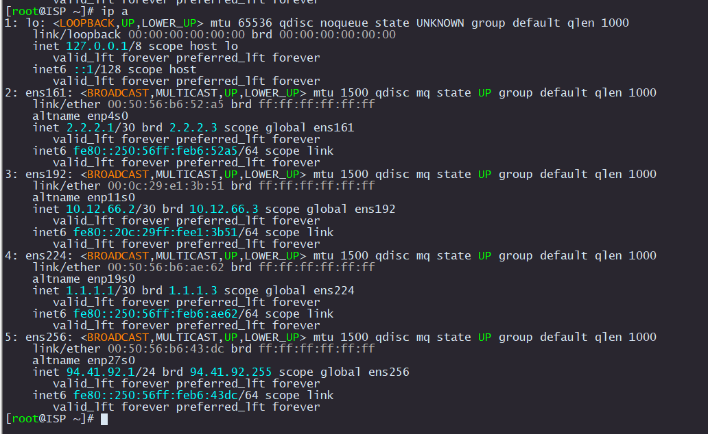

# Назначение IP адреса через etcnet

Если NetworkManager не установлен, то можно использовать встроенную систему `etcnet`

Подробнее про `etcnet` [здесь](https://www.altlinux.org/Etcnet#%D0%98%D1%81%D1%82%D0%BE%D1%87%D0%BD%D0%B8%D0%BA%D0%B8_%D0%B8%D0%BD%D1%84%D0%BE%D1%80%D0%BC%D0%B0%D1%86%D0%B8%D0%B8_%D0%BF%D0%BE_/etc/net)

Для каждого интрефейса из `ip a` должны быть создана онаименная директория в `/etc/net/ifaces/`

<p align="center">
  
</p>

Если таких директорий не существует, то нужно их создать

```
mkdir /etc/net/ifaces/ens161
mkdir /etc/net/ifaces/ens192
mkdir /etc/net/ifaces/ens224
mkdir /etc/net/ifaces/ens256
```

<p align="center">
  
</p>

В каждой папке нужно создать файл `/etc/net/iface/<NAME_INTERFACE>/options`

```
TYPE=eth
DISABLE=no
NM_CONTROLLED=no
BOOTPROTO=static
CONFIG_IPV4=yes
```

или

```
echo "TYPE=eth
DISABLED=no
NM_CONTROLLED=no
BOOTPROTO=static
CONFIG_IPv4=yes" > /etc/net/ifaces/ens161/options
```

проверка

<p align="center">
  
</p>

Для все остальных интерфейсов этот файл идентичный. Поэтому его можно просто скопировать

```
cp /etc/net/ifaces/ens161/options /etc/net/ifaces/ens192/
cp /etc/net/ifaces/ens161/options /etc/net/ifaces/ens224/
cp /etc/net/ifaces/ens161/options /etc/net/ifaces/ens256/
```

Чтобы назначить IP на интерфейс нужно создать файл `/etc/net/ifaces/<NAME_INTERFACE>/ipv4address` в котором написать IP адрес с префиктом `1.1.1.1/30`

```
echo 2.2.2.1/30 > /etc/net/ifaces/ens161/ipv4address
echo 10.12.66.2/24 > /etc/net/ifaces/ens192/ipv4address
echo 1.1.1.1/30 > /etc/net/ifaces/ens224/ipv4address
echo 94.41.92.1/24 > /etc/net/ifaces/ens256/ipv4address
```

На ISP добавим маршрут по умолчанию и DNS для выхода в интернет:

```
echo default via 10.12.66.254 > /etc/net/ifaces/ens192/ipv4route
echo nameserver 8.8.8.8 > /etc/net/ifaces/ens192/resolv.conf
```

> [!CAUTION]
> Обязательно нужно включить маршрутизацию на всех маршрутизаторах

Для включения маршрутизации нужно изменить опцию `net.ipv4.ip_forward = 0` на `net.ipv4.ip_forward = 1`. Эта настройка находится в файле `/etc/net/sysctl.conf`

```
vim /etc/net/sysctl.conf
```

или

```
sed -i -e 's/net.ipv4.ip_forward = 0/net.ipv4.ip_forward = 1/g' /etc/net/sysctl.conf
```

Для применения всех сетевых настроек перезагружаем службу `network`

```
systemctl restart network
```

<p align="center">
  
</p>

Подобные манипуляции нужно проделать на всех виртуальных машинах, кроме CLI. Ее настроим чуть позже