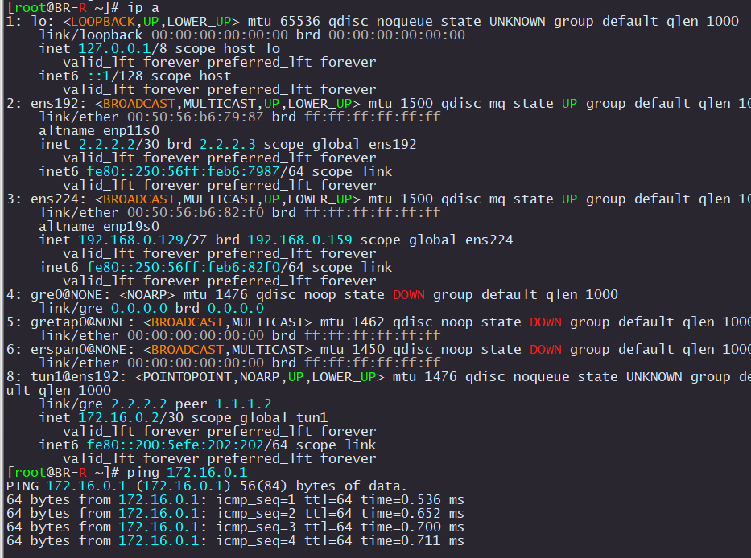

# Создание туннелей между HQ-R и BR-R

Перед настройкой туннеля нужно проверить что между HQ-R и BR-R есть связность

```
ping 2.2.2.2
```

<p align="center">
  
</p>

### HQ-R

```
mkdir /etc/net/ifaces/tun1
echo 172.16.0.1/30 > /etc/net/ifaces/tun1/ipv4address
echo "TYPE=iptun
TUNTYPE=gre
TUNLOCAL=1.1.1.2
TUNREMOTE=2.2.2.2
TUNOPTIONS='ttl 64'
HOST=ens224
" > /etc/net/ifaces/tun1/options
systemctl restart network
```

### BR-R

```
mkdir /etc/net/ifaces/tun1
echo 172.16.0.2/30 > /etc/net/ifaces/tun1/ipv4address
echo "TYPE=iptun
TUNTYPE=gre
TUNLOCAL=2.2.2.2
TUNREMOTE=1.1.1.2
TUNOPTIONS='ttl 64'
HOST=ens192
" > /etc/net/ifaces/tun1/options
systemctl restart network
```

<p align="center">
  
</p>