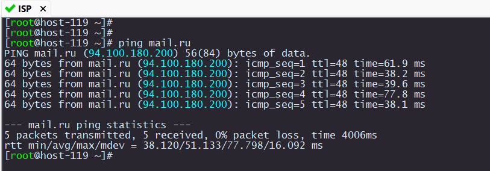
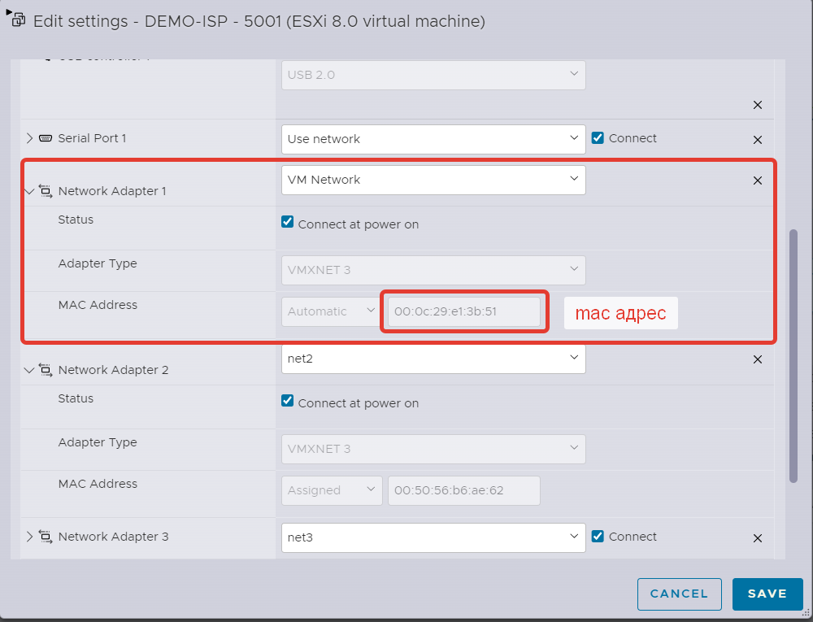
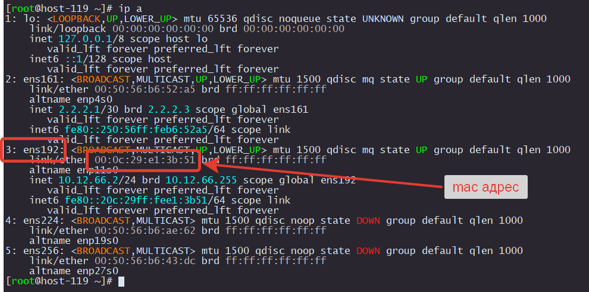
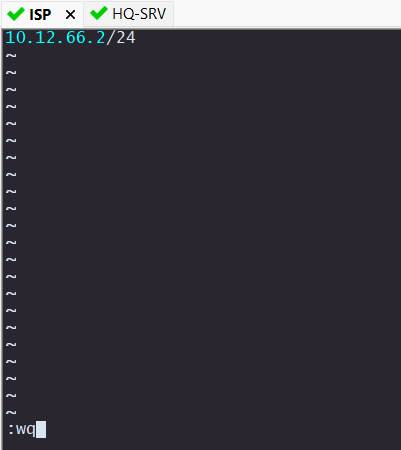
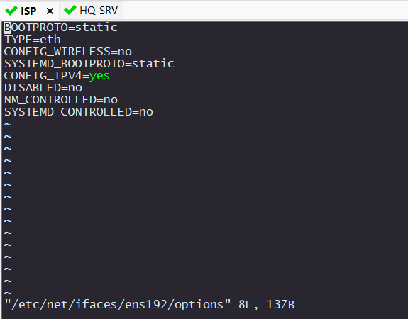
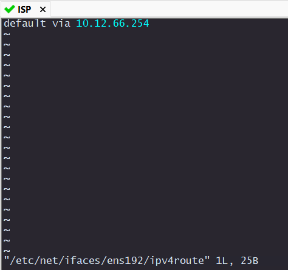
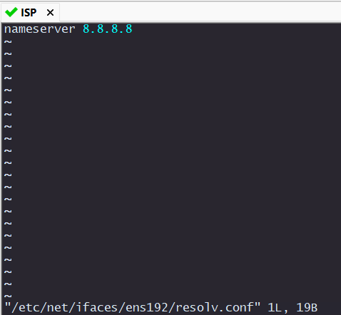
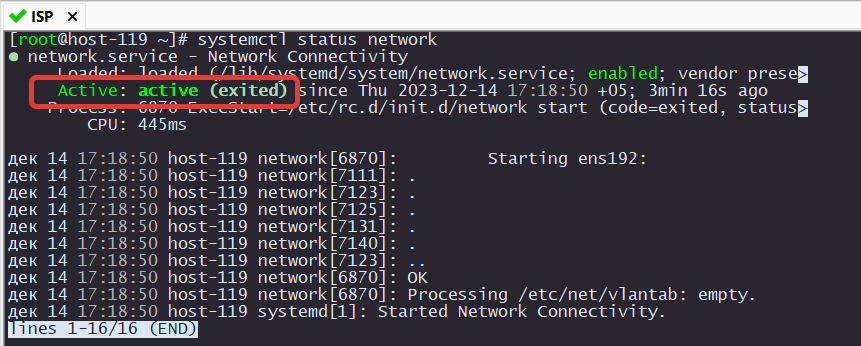
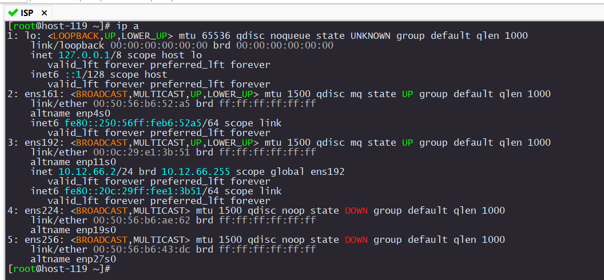

# Подключение виртуальной машины к Интернет.

Если при установке ОС вы следовали моей инструкции, то интернет у вас уже подключен. Давайте проверим это.
Попробуйте сделать пинг любого сайта в интернете.

```
ping mail.ru
```

Если в результате выполнения команды ping вы видите вот такую картину, то я вас поздравляю! Интернет подключен и дальнейшие шаги не нужны.

> [!CAUTION]
> Настоятельно рекомендую ознакомиться с дальнейшей инструкцией, чтобы знать что делать если что-то пошло не так

<p align="center">
  
</p>

Чтобы подключить любую виртуальную машину к Интернету достаточно подключить ее сетевой интерфейс к `VMnetwork` и задать IP из тойже подсети, что и ESXi. Не забывайте, что еще нужно задать `IP шлюза` и `DNS сервера`.

<p align="center">
  
</p>

Если на виртуальной машине есть несколько интерфейсов, то не всегда понятно как они соотносятся с интерфейсами в самой ОС.
Идентифицировать их можно по mac-адресу

В данном примере в ОС интерфейс под `номером 3`, а в списке оборудования виртуальной машины `Network Adapter 1`

<p align="center">
  
</p>

## Настройка IP адреса

В ALT Linux по умолчанию нет всеми любимого редактора `nano`, поэтому будем пользоваться `vim`.

Надеюсь вы уже нашли мануал как пользоваться `VIM`. Не переживайте, дальше это будем делать более простым способом.

```
i - режим редактирования
<ESC> - выход из режима редактирования
:q! - выйти без сохранения
:wq - выйти с сохранением
```

В файл /etc/net/ifaces/ens192/ipv4address прописываем IP.

> [!CAUTION]
> Если вы настроете на виртуалке такой же `IP` как и на `ESXi`, то вы `потеряете` доступ к вашему стенду полностью

```
vim /etc/net/ifaces/ens192/ipv4address 
```

<p align="center">
  
</p>

Также отредактируем файл /etc/net/ifaces/ens192/options

```
vim /etc/net/ifaces/ens192/options
```

<p align="center">
  
</p>

Зададим шлюз. Это такой же IP как и шлюз у вашего ESXi

```
vim /etc/net/ifaces/ens192/ipv4route
```

<p align="center">
  
</p>

Чтобы имена в интернете преобразовывались в IP (mail.ru, ya.ru ит т.д.), нужен DNS сервер. Также укажем его

```
vim /etc/net/ifaces/ens192/resolv.conf
```

<p align="center">
  
</p>

После внесения изменений нужно перезапустить службу network

```
systemctl restart network
```

Теперь проверим, что у нас получилось:

```
systemctl status network
```

```
ip a
```

<p align="center">
  
  
</p>


```
ping mail.ru
```

<p align="center">
  
</p>