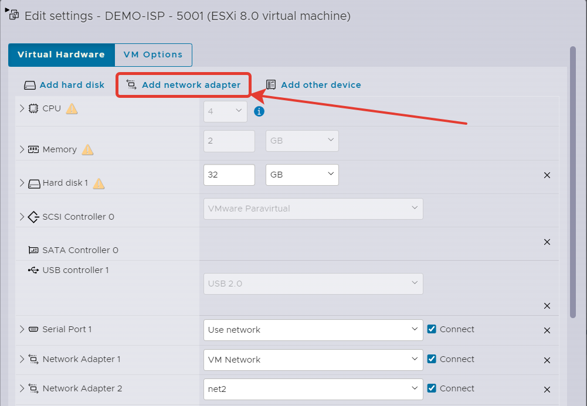
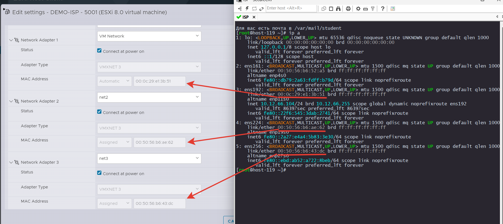
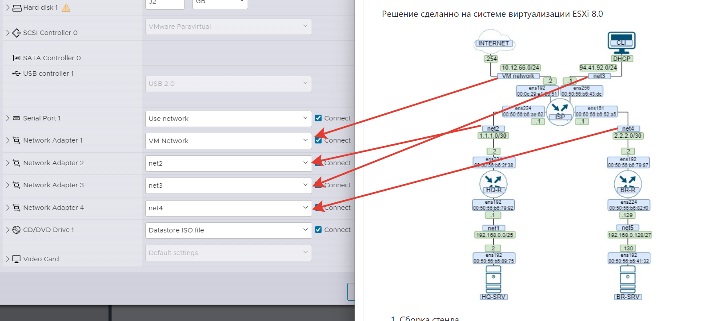

# Подключение виртуальных машин между собой.

Для каждой виртуальной машины добавим недостающие интерфейсы

  

Включаем виртуалку и через `ip a` определяем кто из них кто.

  

Смотрим на топологию и подключаем в соответствующие сети. MAC адреса у вас будут отличаться! Будте внимательны.

  

Такие действия проделываем с каждой виртуалкой.