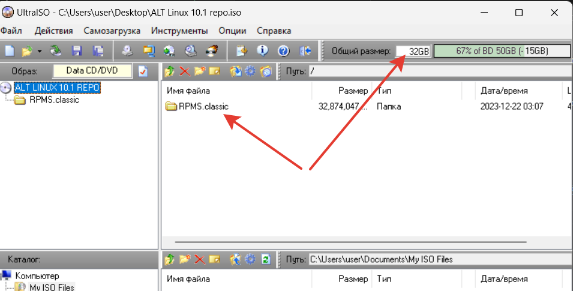
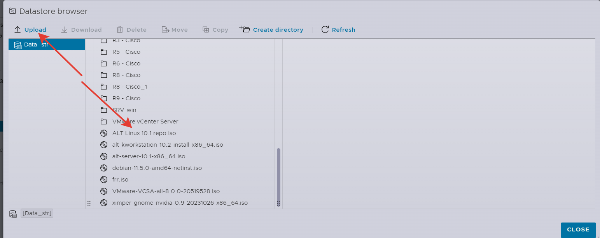
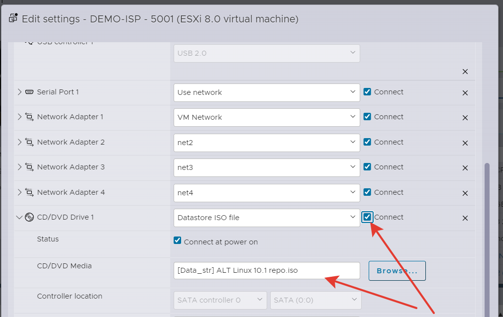
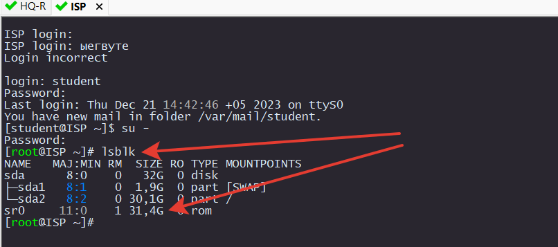
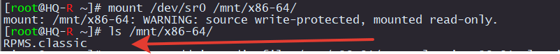
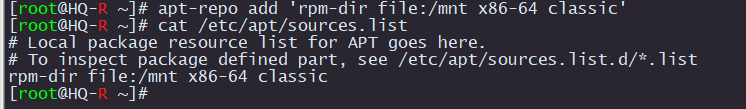
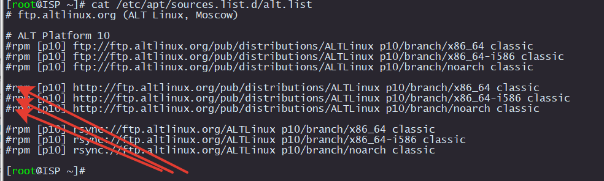
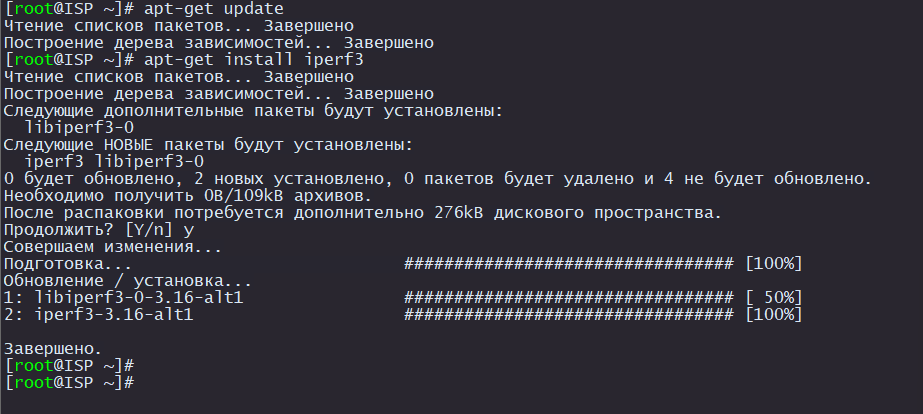

# Создание локального репозитория

Чтобы устанавливать пакеты на виртуалки без Интернерта нужно сделать `ISO` образ репозитория и монтировать его как `DVD` диск к каждой виртуалке.

Он будет храниться в `Datastore` на самом `ESXi`. Учитывайте, что полный репозиторий classic весит порядка 32 Gb.

Можно весь репозиторий не качать, а скачать только необходимые пакеты и их зависимости.

Мы пойдем по универсальному пути. Будем делать полный репозиторий.

### Скачиваем пакеты с офф сайта [здесь](http://ftp.altlinux.org/pub/distributions/ALTLinux/p10/branch/x86_64/RPMS.classic/)

Создаем ISO образ. Название папки обязательно должно начинаться на `RPMS`.

<p align="center">
  
</p>

Закидываем это образ на ESXi

<p align="center">
  
</p>

Подключаем к виртуалке

<p align="center">
  
</p>

Проверяем, что виртуалка его видит. Если его нет, то выключите виртуалку. Подключите диск. Включите виртуалку. Убедитесь, что стоит галка `Connect` напротив `CD/DVD Drive`

```
lsblk
```

<p align="center">
  
</p>

Создаем папку куда будем монтировать диск

```
mkdir -p /mnt/x86-64/
```

Монтируем диск

```
mount /dev/sr0 /mnt/x86-64/
```

Должно получиться вот так.

<p align="center">
  
</p>

Добавляем репозиторий

```
apt-repo add 'rpm-dir file:/mnt x86-64 classic'
```

Должно получиться вот так.

<p align="center">
  
</p>

Отключаем стандартные репозитории.

```
vim /etc/apt/sources.list.d/alt.list
```

Должно получиться вот так.

<p align="center">
  
</p>

Обнавляем репозитории. Репозиторий большой, процесс может занимать некоторое время

```
apt-get update
```

Пробуем установить `iperf3`

```
apt-get install -y iperf3
```

<p align="center">
  
</p>