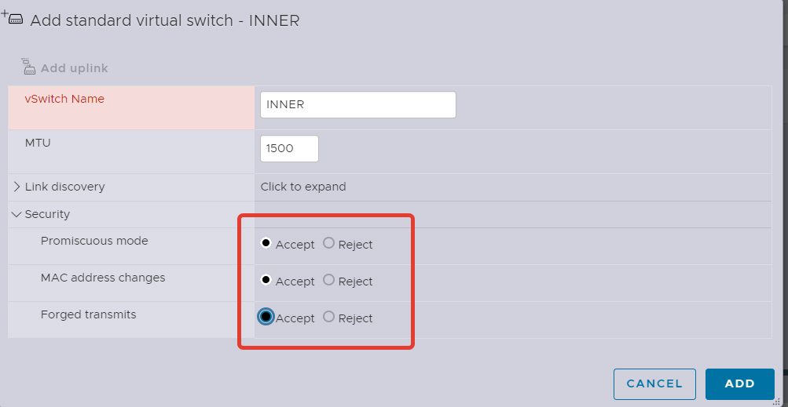
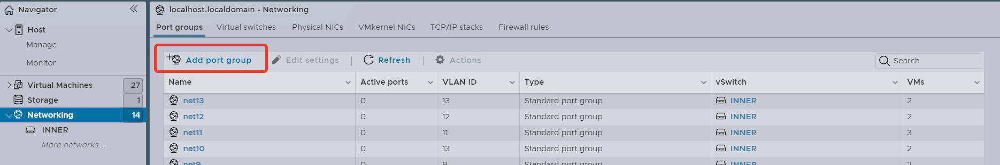
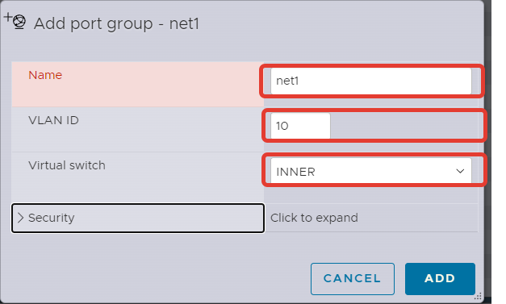

## Создание виртуальных "проводов" для подключения виртуальных машин друг к другу
Прежде чем собирать топологию нужно подумать как отделить трафик интерфейсов виртуальных машин друг от друга.
Для этого создадим виртуальный коммутатор, который в дальнейшем разобъем на vlan. Каждая vlan будет служить отдельной канальной средой для подключения виртуальных машин друг к другу.

  

Чтобы исключить блокировку трафика виртуалок сделаем настройки безопасности `Accept`

  

Создадим `Port Group` к которым будем подключать виртуальные машины.
Важно, чтобы номера vlan у каждой `Port Group` были разные. Также следите чтобы создаваемые `Port Group` были подключены к созданному прежде вами виртуальному коммутатору.

  

  

