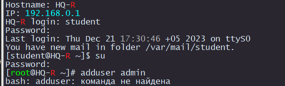

# Создание пользователей

### Общий принцип такой:


> [!CAUTION]
> Если вы переходите в суперпользователя через команду `su`, то комманды не будут доступны

<p align="center">
  
</p>

Переходим в суперпользователя через `su`

Создаем пользователя

```
adduser admin
```

Добавляем его у группу суперпользователя

```
usermod -aG root admin
```

Задаем пароль

```
passwd admin

Enter new password: P@ssw0rd
Re-type new password: P@ssw0rd
```

## HQ-R и HQ-SRV

```
useradd admin
usermod -aG root admin
passwd admin
```

```
adduser network_admin
usermod -aG root network_admin
passwd network_admin
```

## BR-R и BR-SRV

```
adduser network_admin
usermod -aG root network_admin
passwd network_admin
```

```
adduser branch_admin
usermod -aG root branch_admin
passwd branch_admin
```