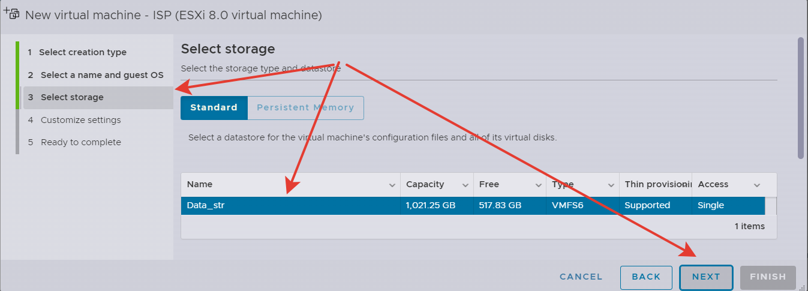
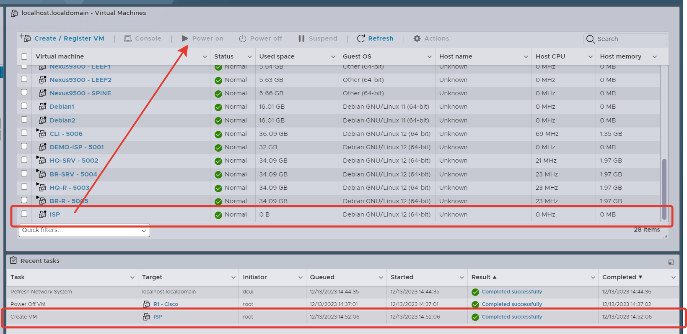

## Создание виртуальных машин

  

  

На этапе выбора шаблона операционной системы в списке нет шаблона для ALT Linux, поэтому выберим примерно похожую конфигурацию.

  

Название место хранения у вас может отличаться от моего, но это не важно. Просто выберите любой доступный диск. Скорее всего у вас он будет один и с другими параметрами объема.

  

1. Чтобы упростить себе жизнь и не заниматься ручным созданиев разделов на диске, объем диска для виртуалки нужно сделать больше 26 Gb. Возбем немного с запасом и изменим на 32 Gb.
2. Предварительно выпустим нашу виртуалку в интернет, чтобы обновить до последней версии и установим пакеты, которые потребуются на первое время. Т.е. этот интерфейс подключен к тойже сети, что и ваш ESXi.
3. В хранилище ESXi должен быть образ ОС с Alt Server. Выберите его. Если такого образа нет, нужно его туда загрузить. Последнюю актуальну версию можно взять [здесь](https://www.altlinux.org/Releases/Download)

Нажимаем Next и Finish

  

Виртуальная машина была создана. Теперь ее можно запускать.

  

