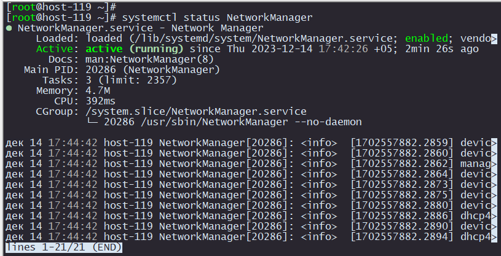
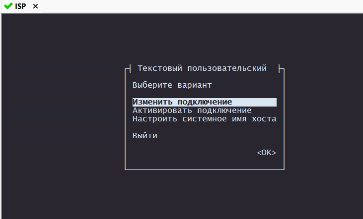
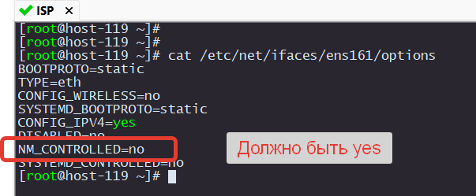

# Установка NMTUI

Чтобы облегчить себе жизнь в настройке интерфесов установим менеджер 

```
apt-get install NetworkManager-tui
```

Запустим его и добавим в автозагрузку.

```
systemctl start NetworkManager
systemctl enable NetworkManager
```

Проверим, что все хорошо:

```
systemctl status NetworkManage
```

<p align="center">
  
</p>

Запускаем:

```
nmtui
```

<p align="center">
  
</p>

Поздравляю! Теперь вы можете радактировать интерфейсы без страшного VIM-a

Осталось только убедиться, что вы видите все интерфейсы из ip a внутри nmtui.
Если каких-то интерфейсов нет, то проверяем /etc/net/ifaces/[имя интерфейса]/options

Например:
```
cat /etc/net/ifaces/ens161/options
```

<p align="center">
  
</p>

Если идим строку NM_CONTROLLED=no, редактируем при помощи ужасного VIM-a :-)

Перезапускаем сеть и NetworkManager

```
systemctl restart network
systemctl restart NetworkManager
```