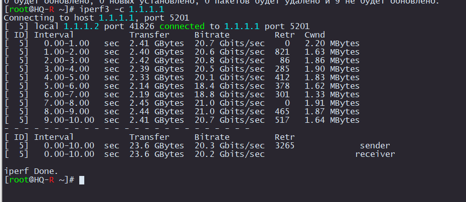

# Измерение пропускной способности при помощи iperf3

Установим пакет `iperf3` на `HQ-R` и `ISP`

```
apt-get install iperf3
```

На `ISP` запустим `iperf3` в качестве сервера

```
iperf3 -s
```

На `HQ-R` запустим `iperf3` в качестве клиента. Посде `-c` пишем IP ISP

```
iperf3 -c 1.1.1.1
```

Должен получиться подобный результат

<p align="center">
  
</p>