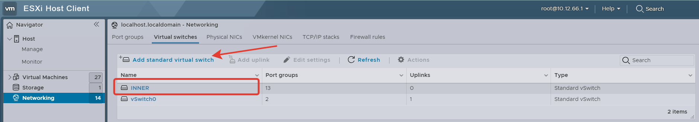
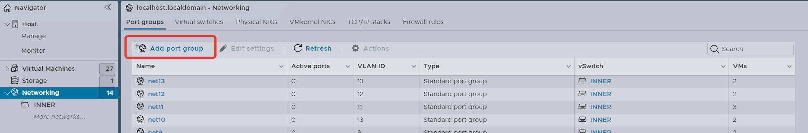
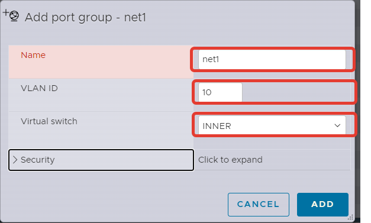
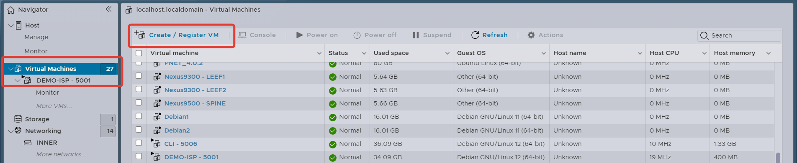
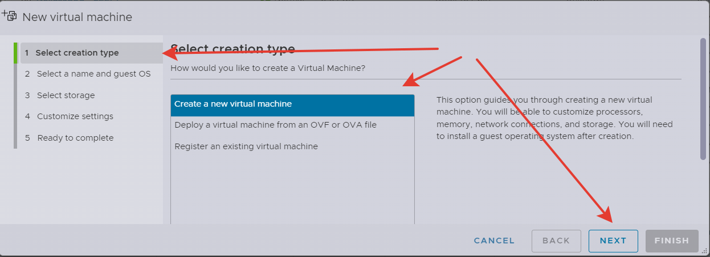
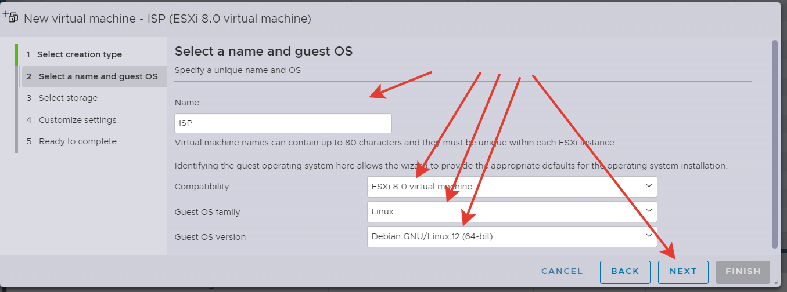
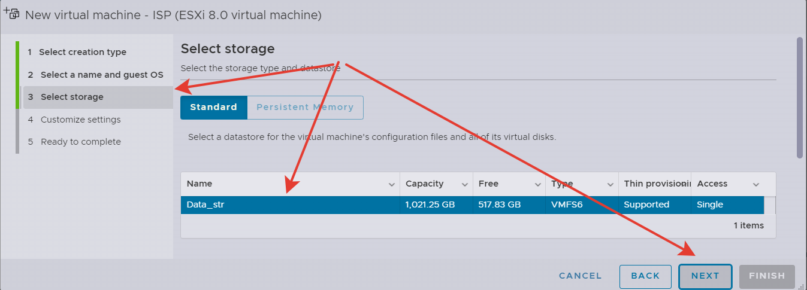

# Модуль 1 - Задине №1

[Задание](https://github.com/netadmin-str/demo2024/blob/0dd3bcfb0f4795cdd9ba3036ebb091167852f48b/%D0%B7%D0%B0%D0%B4%D0%B0%D0%BD%D0%B8%D0%B5/%D0%9C%D0%BE%D0%B4%D1%83%D0%BB%D1%8C%201%20-%20%D0%97%D0%B0%D0%B4%D0%B0%D0%BD%D0%B8%D0%B5%20%E2%84%961.md)

Решение сделанно на системе виртуализации ESXi 8.0

  

## Создание виртуальных "проводов" для подключения виртуальных машин друг к другу
Прежде чем собирать топологию нужно подумать как отделить трафик интерфейсов виртуальных машин друг от друга.
Для этого создадим виртуальный коммутатор, который в дальнейшем разобъем на vlan. Каждая vlan будет служить отдельной канальной средой для подключения виртуальных машин друг к другу.

  

Чтобы исключить блокировку трафика виртуалок сделаем начтройки безопасности Accept

  

Создадим Port Group к которым будем подключать виртуальные машины.
Важно, чтобы номера vlan у каждой порт группы были разные. Также следите чтобы создаваемые Port Group были подключены к созданному прежде вами виртуальному коммутатору.

  

  

## Создание виртуальных машин

  

  

На этапе выборе шаблона операционной системы нет шаблона для ALT Linux, поэтому выберим примерно похожую конфигурацию.

  

Название место хранения у вас может отличаться от моего, но это не важно. Просто выберите любой доступный диск. Скорее всего у вас он будет один и с другими параметрами объема.

  

