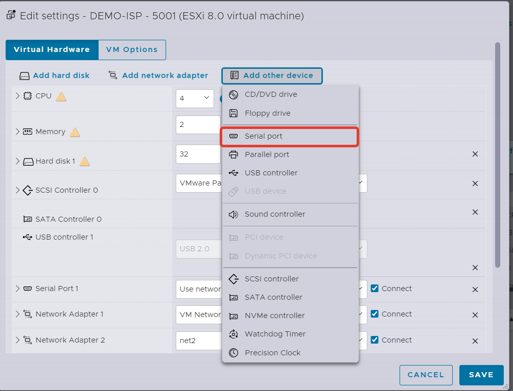
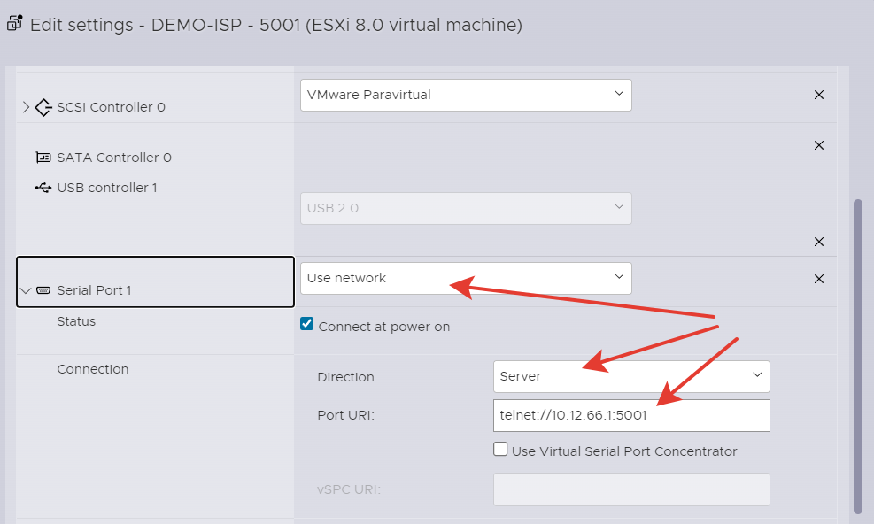
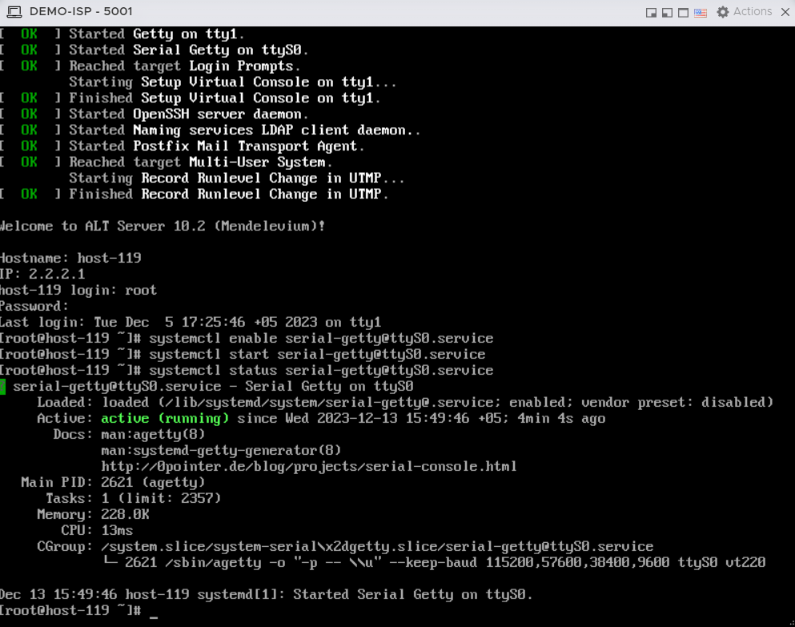
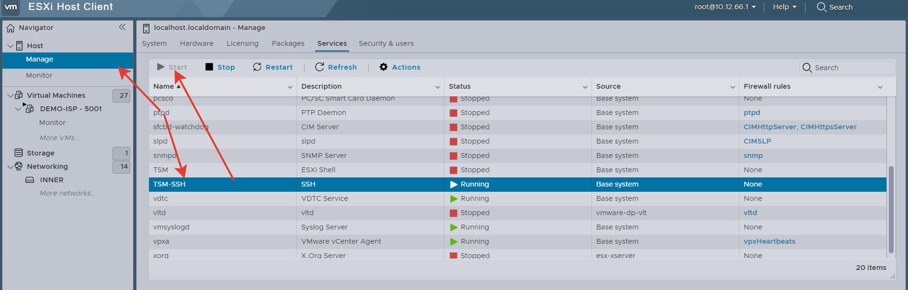
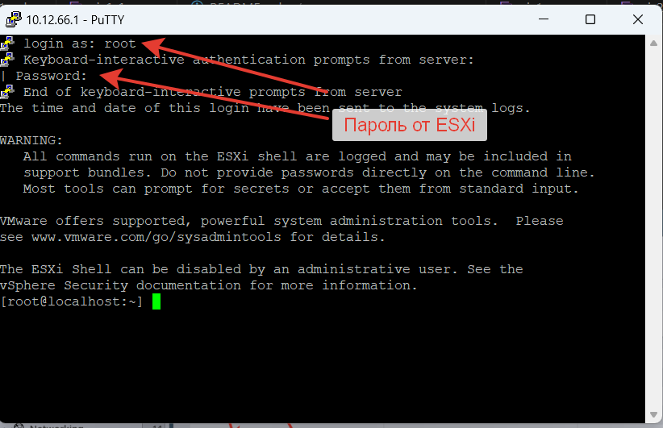
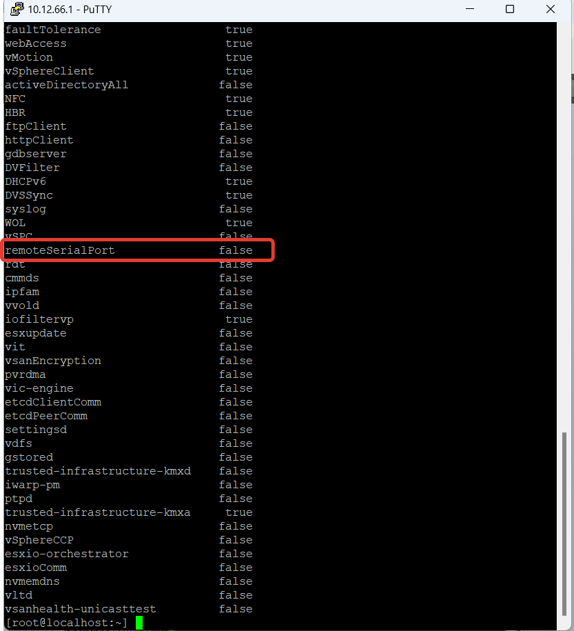
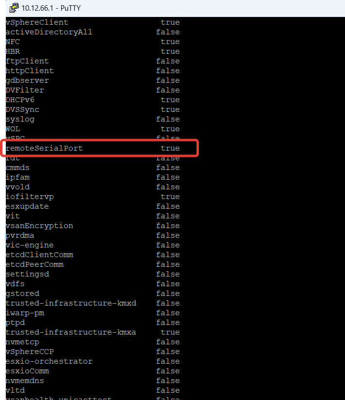
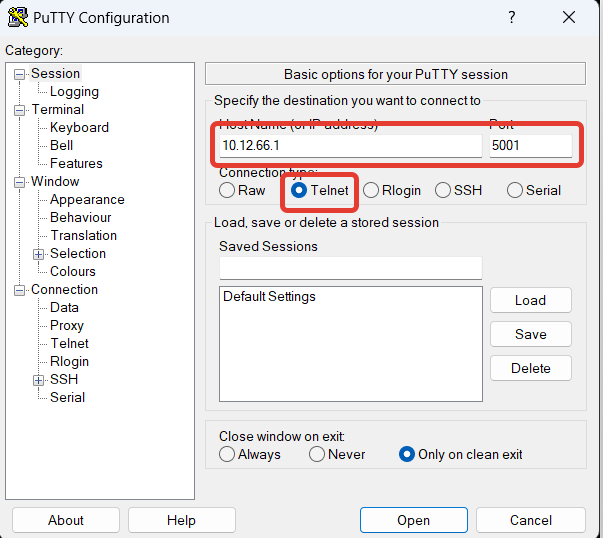

# Подключение к виртуальной машине через консоль

Нужно добавить дополнительное устройство Serial port в виртуальной машине.
<p align="center">
  
</p>


Для каждой виртуалки порт должен быть уникальным.
Например если есть две машины ISP и HQ-R, то для ISP делаем порт 5001, а для HQ-R - 5002
<p align="center">
  
</p>

В самой ОС нужно включить службу, добавить ее в автозагрузку и проверить статус:
```
systemctl start serial-getty@ttyS0.service
systemctl enable serial-getty@ttyS0.service
systemctl status serial-getty@ttyS0.service
```
<p align="center">
  
</p>


#### Чтобы ESXi не блокировал трафик идущий на serial интерфейс виртуальных машин, нужно включить правило remoteSerialPort в фаерволе самого ESXi
Для этого запустим службу ssh для подключения по SSH к самому ESXi
<p align="center">
  
</p>

При помощи любой консоли подключаемся по ssh к ESXi. Пользователь и пароль такие же как вы подключаетесь через web браузер к ESXi
<p align="center">
  
</p>

Проверим список правил Firewall
```
esxcli network firewall ruleset list
```
<p align="center">
  
</p>

Теперь нужно правило remoteSerialPort переключить в состояние true:
```
esxcli network firewall ruleset set --enabled=true --ruleset-id=remoteSerialPort
```
<p align="center">
  
</p>

Пробуем подключиться к нашей виртуальной машине
<p align="center">
  
</p>

По умолчанию пользователю root запрещен доступ через Serial консоль, поэтому залогинимся обычным пользователем.
<p align="center">
  
</p>