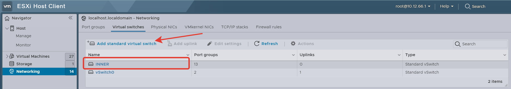

## Создание виртуальных "проводов" для подключения виртуальных машин друг к другу
Прежде чем собирать топологию нужно подумать как отделить трафик интерфейсов виртуальных машин друг от друга.
Для этого создадим виртуальный коммутатор, который в дальнейшем разобъем на vlan. Каждая vlan будет служить отдельной канальной средой для подключения виртуальных машин друг к другу.

  

Чтобы исключить блокировку трафика виртуалок сделаем начтройки безопасности Accept

  

Создадим Port Group к которым будем подключать виртуальные машины.
Важно, чтобы номера vlan у каждой порт группы были разные. Также следите чтобы создаваемые Port Group были подключены к созданному прежде вами виртуальному коммутатору.

  

  

## Создание виртуальных машин

  

  

На этапе выборе шаблона операционной системы нет шаблона для ALT Linux, поэтому выберим примерно похожую конфигурацию.

  

Название место хранения у вас может отличаться от моего, но это не важно. Просто выберите любой доступный диск. Скорее всего у вас он будет один и с другими параметрами объема.

  

1. Чтобы упростить себе жизнь и не заниматься ручным созданиев разделов на диске, объем диска для виртуалки нужно сделать больше 26 Gb. Возбем немного с запасом и изменим на 32 Gb.
2. Предварительно выпустим нашу виртуалку в интернет, чтобы обновить до последней версии и установим пакеты, которые потребуются на первое время. Т.е. этот интерфейс подключен к тойже сети, что и ваш ESXi.
3. В хранилище ESXi должен быть образ ОС с Alt Server. Выберите его. Если такого образа нет, нужно его туда загрузить. Последнюю актуальну версию можно взять [здесь](https://www.altlinux.org/Releases/Download)
Нажимаем Next и Finish

  

Виртуальная машина была создана. Теперь ее можно запускать.

  

Процесс установки показан здесь:
[Установка ALT Linux](https://github.com/netadmin-str/demo2024/blob/044bcd98a8dc471a9e0e326ed96d307aa029e6f8/%D1%80%D0%B5%D1%88%D0%B5%D0%BD%D0%B8%D0%B5/%D0%9C%D0%BE%D0%B4%D1%83%D0%BB%D1%8C%201/%D1%83%D1%81%D1%82%D0%B0%D0%BD%D0%BE%D0%BA%D0%B0%20ALTLinux/README.md)

### (Опционально) Настройка внеполосного управления виртуальными машинами
Чтобы упростить себе жизнь и в дальнейшем не заниматься переписыванием комманд из мануалов в ручную, а использовать копипаст можно настроить управление виртуальными машинами через консоль. Например Putty, SecureSRT и т.д.

[Инструкция по настроке консоли](https://github.com/netadmin-str/demo2024/blob/4633f277ede37e2a72216af21e355185197437e7/%D1%80%D0%B5%D1%88%D0%B5%D0%BD%D0%B8%D0%B5/%D0%9C%D0%BE%D0%B4%D1%83%D0%BB%D1%8C%201/%D0%BF%D0%BE%D0%B4%D0%BA%D0%BB%D1%8E%D1%87%D0%B5%D0%BD%D0%B8%D0%B5%20%D1%87%D0%B5%D1%80%D0%B5%D0%B7%20%D0%BA%D0%BE%D0%BD%D1%81%D0%BE%D0%BB%D1%8C/README.md)

